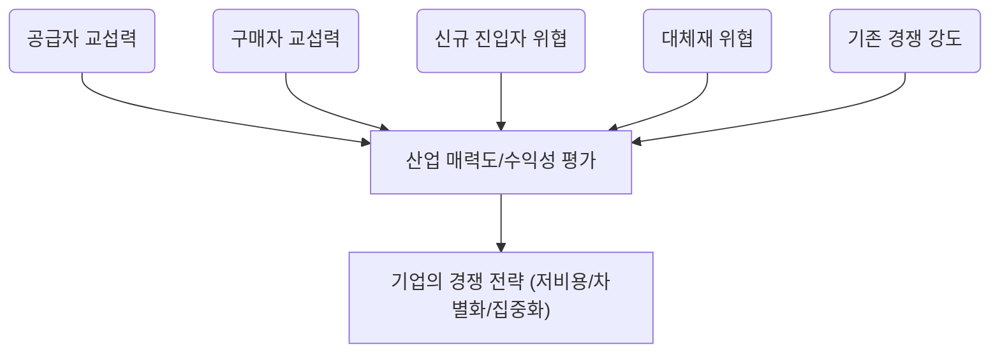

- **"우리 회사가 속한 동네가 돈이 될까?"**를 알려주는 마법의 돋보기가 바로 포터의 5가지 힘 분석 모델입니다. 이 모델은 우리가 어떤 산업에 뛰어들 때, 그 산업의 **수익성**을 미리 점쳐보고 성공적인 **전략**을 세우는 데 결정적인 도움을 줍니다. 결국, 이 5가지 힘을 꽉 잡아야 경쟁에서 이기고 돈을 벌 수 있다는 거죠.

## 1. 포터의 5가지 힘: 비즈니스의 '주변 환경' 탐색

- 이 분석은 단순히 우리 회사 내부만 보는 게 아니라, 우리가 속한 **산업 전체**의 매력을 평가하는 도구예요.
- 마치 부동산을 살 때 집의 내부뿐만 아니라 동네의 치안, 교통, 학군을 모두 살펴보는 것과 비슷하죠.
- 핵심은 **산업 자체가 얼마나 돈이 잘 되는 구조인지**를 다섯 가지 관점으로 쪼개보는 것입니다.
- 이 분석을 통해 기업은 어떤 시장에서 싸워야 할지, 그리고 어떻게 자리를 잡아야 할지 **전략적 판단**을 내릴 수 있게 됩니다.

## 2. 경쟁의 5가지 근원: 이들을 파악해야 성공한다

- 포터 교수는 산업 내 경쟁이 일어나는 근본적인 이유가 딱 다섯 가지라고 정리했어요.
- 이 다섯 가지 힘이 **강할수록** 그 산업은 돈 벌기가 어렵고, **약할수록** 수익성이 높다는 뜻입니다.
- 이 다섯 가지 힘을 이해하면 기업은 시장의 **경쟁 강도**와 **매력도**를 한눈에 파악할 수 있어요.
- 다섯 가지 힘은 공급자의 힘, 구매자의 힘, 신규 진입자의 위협, 대체재의 위협, 그리고 **기존 경쟁자** 간의 싸움입니다.

## 3. 공급자의 힘: 재료 깎아내리기 선수들

- 공급자(원재료나 부품을 주는 사람)가 우리에게 콧대를 세울 수 있는지를 보는 힘이에요.
- 만약 우리 제품 원가의 **대부분을 그들의 재료**가 차지한다면 그들은 갑이 될 수밖에 없죠.
- 또, 그들이 파는 물건을 다른 회사에서 구하기 **너무 어렵거나** 바꿀 때마다 큰 **추가 비용**이 든다면 힘이 세집니다.
- 이들은 우리 회사를 건너뛰고 우리 고객에게 직접 팔 수도(전방 통합) 있어서 더 무섭죠.

## 4. 구매자의 힘: 가격 흥정의 달인들

- 구매자(우리가 만든 물건을 사주는 고객)가 가격을 마구 깎아내리거나 품질을 높이 요구할 수 있는지 분석하는 거예요.
- 만약 우리 회사 제품을 사는 **큰 손님**이 소수라면, 그들은 가격 협상에서 우위를 점하기 쉽습니다.
- 우리가 만든 제품이 **너무 흔해서** (표준화되어 있어서) 고객이 다른 곳에서 쉽게 사 올 수 있다면 힘이 강해지죠.
- 반대로, 고객이 우리 회사를 **바꾸는 데 드는 노력(전환 비용)**이 크다면 그들의 힘은 약해집니다.

## 5. 신규 진입자의 위협: 시장을 노리는 잠재적 경쟁자들

- 아직 우리 시장에 들어오지 않았지만, 언제든 **문 부수고 들어와서** 시장 파이를 뺏어갈 수 있는 잠재적 경쟁자에 대한 경계심입니다.
- 이들의 위협 수준은 **진입 장벽(Barrier to Entry)**이 얼마나 높은가에 달려 있어요.
    - 규모의 경제: 회사가 커질수록 물건 하나 만드는 단가가 싸지면, 작은 신규 업체는 따라오기 힘들어요.
    - 기술적 우위나 특허: 독점 기술이 있으면 남들이 따라 하기 어렵습니다.
    - 채널 확보: 이미 좋은 유통망이나 브랜드 평판을 선점했다면 신규 업체가 비집고 들어오기 어렵습니다.

## 6. 대체재의 위협: '완전히 다른 것'의 습격

- 대체재는 우리 제품과 **완전히 다른 종류**이지만, 고객의 **같은 욕구**를 채워줄 수 있는 것을 말해요.
- 예를 들어, KTX의 대체재는 비행기일 수도 있지만, '빨리 이동하고 싶다'는 욕구 충족에서는 자동차도 넓은 의미의 대체재가 될 수 있어요.
- 대체재가 너무 좋거나 싸게 등장하면, 우리 제품 가격을 올리기 힘들어지거나 품질 개선 압박을 받게 됩니다.
- 고객이 **쉽게 대체재로 갈아탈 수 있다면** (전환 비용이 낮다면) 이 위협은 더욱 커집니다.

## 7. 산업 내 경쟁 강도: 치열한 내부 싸움

- 같은 시장에서 이미 활동 중인 경쟁사들끼리 피 튀기는 싸움을 하는 정도를 의미해요.
- 이 경쟁은 주로 **가격 인하, 광고, 신제품 출시** 등으로 나타나며 서로의 이익을 깎아내리죠.
- 경쟁이 심해지는 주된 이유는 시장이 성장 정체기에 접어들었거나, 경쟁사들이 너무 많을 때 발생합니다.
- 결국 이 내부 경쟁이 치열하면, **산업 전체의 평균 수익률**은 낮아지게 됩니다.

## 8. 5가지 힘의 관계: 전체적인 그림 보기

- 이 다섯 가지 힘은 서로 분리된 것이 아니라, 복잡하게 얽혀 산업의 수익성을 결정해요.
- 이 모델은 **"우리가 어느 산업에서 싸울지"**를 결정하는 데 최적화된 도구입니다.
- 분석 후에는 우리 회사의 **자원**과 산업의 매력도를 비교하여 전략을 짜야 해요.
- 전략은 고정된 것이 아니라 시장 변화에 따라 **유연하게 조정**되어야 하므로, 이 분석은 주기적인 피드백 과정이 필요합니다.

