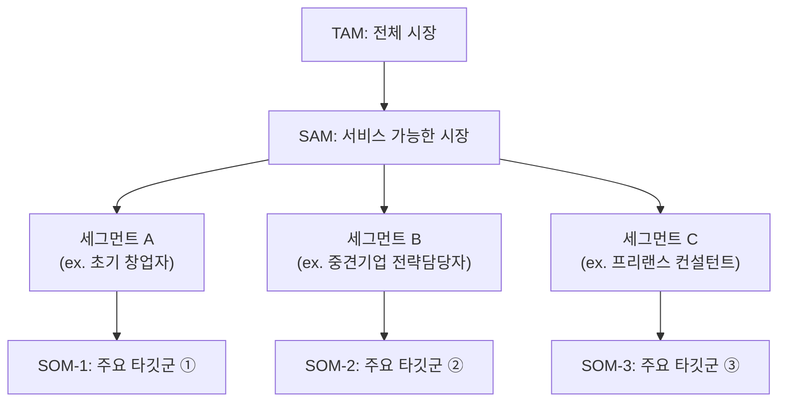

### 1. **시장 규모 분석의 세 가지 층위**

> TAM, SAM, SOM : “시장 크기를 정량적으로 파악하는 계층적 도식”

| 구분 | 의미 | “SaaS 온라인 비즈니스 컨설팅 시장” 사례의 시장 Breakdown 예시 | 시장 규모 산정을 위한 주요 데이터 출처 |
| --- | --- | --- | --- |
| **TAM (Total Addressable Market)** | 전체 시장 규모 – “이론적으로 접근 가능한 전체 수요” | 글로벌 SaaS 비즈니스 컨설팅 시장 | Statista, IBISWorld, Crunchbase |
| **SAM (Serviceable Available Market)** | 실제로 서비스 가능한 시장 – “우리 제품/서비스가 현실적으로 도달 가능한 영역” | 한국 내 스타트업 컨설팅 SaaS 시장 | K-Startup, 중소기업청, AI Hub |
| **SOM (Serviceable Obtainable Market)** | 단기적으로 점유 가능한 시장 – “현재 리소스로 실현 가능한 목표 범위” | 초기 타깃 3개 산업군(교육, 프리랜스, 리테일) | 설문·JTBD 인터뷰, 검색 트렌드 |

---

### 2. **Segment Map**

> 시장을 단순 수치로 나누는 게 아니라, ‘행동 단서’와 ‘구매 맥락’ 중심으로 시각화하는 지도
> 

**TAM-SAM-SOM 과의 관계 구조**

