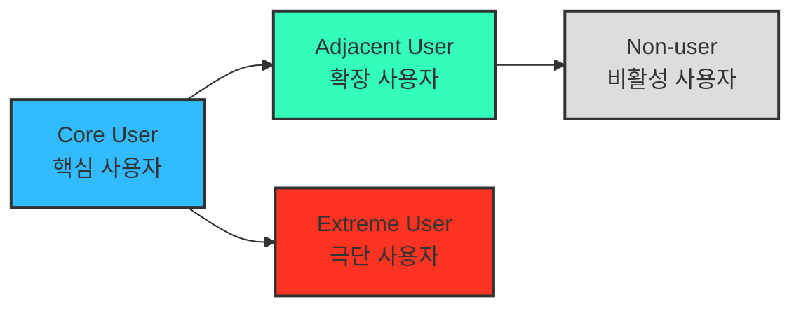

### 1. **페르소나 (Persona)**

> 사용자 연구의 대표적 산출물이지만,
> 
> 
> AI 시대의 페르소나는 더 이상 정적 프로필이 아니라,
> “**`행동과 맥락의 시뮬레이션 모델`**”이 되어야 함!
> 

| 구분 | 전통적 페르소나 | AI 확장형 페르소나 |
| --- | --- | --- |
| 초점 | 인구통계, 직업, 연령 등 속성 중심 | 과업·문제·맥락 중심 |
| 데이터 소스 | 설문/관찰 중심 | AI 기반 데이터 리서치, 소셜 트렌드, ~~JTBD 프리뷰~~ |
| 활용 목적 | 대표 사용자 이미지화 | 시나리오 시뮬레이션, 인터뷰 대상 선정 |

**AI 프롬프트 예시**

- 잘못된 예
    
    ```markdown
    내 비즈니스는 [SaaS형 온라인 비즈니스 컨설팅 플랫폼]이야.
    이 서비스를 사용할 만한 **주요 고객 유형 3가지를 설정**해줘.
    이 고객 유형들에 각각 유형 이름, 역할, 주요 문제, 목표, 사용 맥락을 포함해줘.
    ```
    
    → 기존 분석내용이 적용되지 않고, **임으로 선택한 가상의 페르소나** 에 가까운 결과 도출 가능성
    
- 잘된 예
    
    ```markdown
    내 비즈니스는 [SaaS형 온라인 비즈니스 컨설팅 플랫폼]이야. (참고자료 첨부)
    **이 서비스를 위한 TAM-SAM-SOM + Market Segment 를 참고하여.
    Market Segment 가 정의하고있는 고객 그룹 유형들로부터 페르소나를 추출하고,
    각각 페르소나 유형명, 역할, 주요 문제, 목표, 사용 맥락을 포함해줘.**
    ```
    

---

### 2. **페르소나 스펙트럼 (Persona Spectrum)**

> 극단적·비전형적 사용자까지 포함해
> 서비스의 **포용성(Inclusivity)** 과 **사용 맥락의 다양성**을 확보하는 분석 방법.



**페르소나 스펙트럼 유형별 설명**

| 구분 | 설명 | 목적 | 생성 포인트 |
| --- | --- | --- | --- |
| **핵심(Core)** | 이상적인 주요 고객군 | 주력 타깃 설정 | 매출/사용 빈도 중심 |
| **확장(Adjacent)** | 유사 문제를 가진 인접 시장군 | 확장 기회 탐색 | 유사 니즈/다른 맥락 |
| **극단(Extreme)** | 제약·극단적 상황을 가진 사용자 | 제품 개선 및 포용적 설계 | 실패·불편·대안 사용 중심 |
| **비활성(Non-user)** | 아직 사용하지 않거나 회피하는 집단 | 시장 진입 장벽 및 거부 요인 파악 | 인식·가치·신뢰 결여 중심 |

**페르소나 스펙트럼 도출 핵심 질문**

- (확장) “유사한 제품/서비스를 사용하고 있는 사람은 누구인가?”
- (비활성) “이 제품/서비스를 `사용할 수 없는 사람`은 누구인가?”
- (극단) “가장 자주 실패를 경험하는 사람은 누구인가?”

> 💡 AI 활용 방향:
AI를 고객의 ‘다양한 가능성’을 빠르게 탐색하는 프로토타이핑 파트너로 삼아 각 사용자 군의 맥락적 특성과 감정적 동기를 가상으로 생성
> 

### ⚙️ **AI 기반 다중 페르소나 생성 및 평가 워크플로우**

| 단계 | 목적 | AI 프롬프트 예시 | 산출물 |
| --- | --- | --- | --- |
| **① 1차 생성 (Divergent Thinking)** | 각 스펙트럼 유형별 3~5개 버전 생성 | “핵심 사용자 5명, 확장 사용자 3명, 극단 사용자 2명, 비활성 사용자 2명을 만들어줘. 각자는 이름, 직무, 문제, 목표, 감정, 대체 솔루션을 포함해.” | 총 10~12개 페르소나 원본 |
| **② 2차 평가 (Convergent Filtering)** | 생성된 페르소나를 평가 및 선별 | “각 페르소나를 문제·행동·맥락의 현실성 기준으로 평가해, 상위 1개씩만 추천해줘.” | 4개 대표 페르소나 (Core, Adjacent, Extreme, Non-user) |
| **③ 3차 보정 (Contextual Rewriting)** | 사업 주제에 맞게 언어 및 상황 맞춤화 | “우리의 서비스 맥락(예: SaaS 컨설팅 플랫폼)에 맞춰 다시 기술해줘.” | 실제 적용 가능한 4종 페르소나 카드 |
| **④ 4차 검증 (AI Peer Review)** | 다중 AI 교차검증 | “이 4명의 페르소나가 실제 시장에서 존재할 확률과 근거를 설명해줘.” | 검증 코멘트 요약 리포트 |
| **⑤ 5차 통합 (Spectrum Map)** | 페르소나 간 관계 구조화 | Mermaid / Figma로 시각화 | Persona Spectrum Map 완성 |

📊 다중 페르소나 생성 프롬프트 예시

```markdown
***내 비즈니스는 [여기에 비즈니스명 작성]이고, 현재까지 해당 시장에 대한 분석 내용은 다음과 같다.
[참고자료 첨부]**
**이 서비스를 위한 TAM-SAM-SOM + Market Segment는 다음과 같다.
[참고자료 첨부]***

지금부터 현재 시장 세그먼트 분석에 따른 고객 페르소나 스펙트럼을 도출하고 싶어.
아래 내용에 맞추어서 페르소나 스펙트럼 유형에 따라 페르소나를 여러 명씩 만들어 줘.

구체적으로, 핵심 사용자 5명, 확장 사용자 3명, 극단 사용자 2명, 비활성 사용자 2명을 만들어줘. 각 페르소나에 대한 가상의 이름, 직무, 문제, 목표, 감정, 대체 솔루션을 포함해줘.

---
**페르소나 스펙트럼 유형별 설명**

| 구분 | 설명 | 목적 | 생성 포인트 |
| --- | --- | --- | --- |
| **핵심(Core)** | 이상적인 주요 고객군 | 주력 타깃 설정 | 매출/사용 빈도 중심 |
| **확장(Adjacent)** | 유사 문제를 가진 인접 시장군 | 확장 기회 탐색 | 유사 니즈/다른 맥락 |
| **극단(Extreme)** | 제약·극단적 상황을 가진 사용자 | 제품 개선 및 포용적 설계 | 실패·불편·대안 사용 중심 |
| **비활성(Non-user)** | 아직 사용하지 않거나 회피하는 집단 | 시장 진입 장벽 및 거부 요인 파악 | 인식·가치·신뢰 결여 중심 |

**페르소나 스펙트럼 도출 핵심 질문**

- (확장) “유사한 제품/서비스를 사용하고 있는 사람은 누구인가?”
- (비활성) “이 제품/서비스를 `사용할 수 없는 사람`은 누구인가?”
- (극단) “가장 자주 실패를 경험하는 사람은 누구인가?”
```

**💡 페르소나 평가 기준 (AI 평가 단계 활용)**

| 평가 항목 | 질문 | 기준 |
| --- | --- | --- |
| 현실성 | “이 인물이 실제 시장에서 존재할 확률은?” | 데이터 근거 포함 |
| 차별성 | “이 인물은 다른 페르소나와 어떤 점이 뚜렷하게 다른가?” | 행동·맥락 기준 |
| 통찰성 | “이 인물의 Pain 정의가 그에 따른 니즈나 욕구를 도출할 수 있는 유효한 내용인가?” | 진보 욕구(Progress) 중심 |
| 전략성 | “이 인물은 MVP 설계에 어떤 인사이트를 주는가?” | 기능·메시지 매핑 가능성 |

### 3. **고객 여정지도 (Customer Journey Map, CJM)**

> 고객이 “문제를 인식 → 해결을 탐색 → 구매/사용 → 평가/유지”와 같은 과정에서 겪는 경험, 감정, Pain Point를 시각화한 흐름도.

### 고객 여정의 단계를 정의하는 방법 → https://www.ibm.com/kr-ko/think/topics/customer-journey-map

### 💡 *비즈니스 문제의 유형에 따라 맞춤형 고객 여정지도가 도출될 수 있음!*

- **가구 시장에 대한 CJM → “`실측`” & “`조립/설치`”** 단계를 포함
    
- **자동차 시장에 대한 CJM → “`비교`” & “`시승`” & “`협상`”** 단계를 포함


> ***“예쁘면 다 좋은 게 아니라, 지식으로서 가치있는 부분을 가독성 높고 재사용하기 쉽게 추출하기”***

| **단계** | 고객 행동 | 고객 생각 | 감정 | Pain Point | 개선 기회 |
| --- | --- | --- | --- | --- | --- |
| **문제 인식** | 불편함을 느낌 | “이 문제 왜 생기는 거지?” | 불안 | 정보 부족 | 문제 원인 콘텐츠 제공 |
| **탐색** | 대안을 찾음 | “이건 괜찮아 보이는데?” | 기대 | 복잡한 비교 | 비교 툴 제공 |
| **의사결정** | 선택 고민 | “이걸 사도 될까?” | 불안 | 신뢰 부족 | 후기·데모 제공 |
| **사용** | 실제 사용 | “생각보다 어렵네” | 실망 | UX 미흡 | 온보딩 개선 |
| **유지** | 반복 사용 | “이제 익숙해졌네” | 안정 | 가치 감소 | 리텐션 캠페인 |