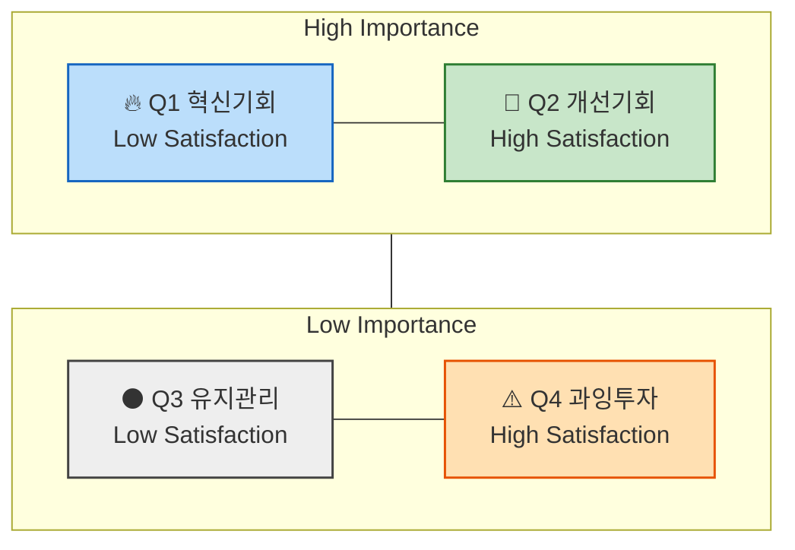
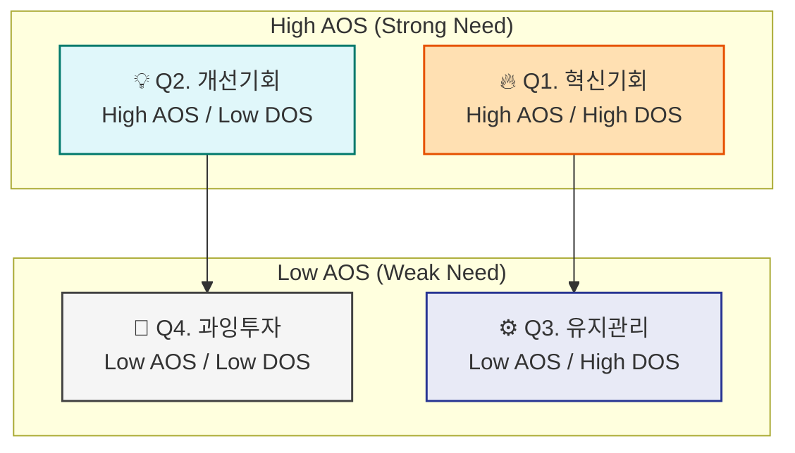

## 1️⃣ `기회점수(OS, Opportunity Score)`란?
     & `조정형 기회점수(AOS, Adjusted Opportunity Score)`란?

> **전통적 `기회점수` OS**의 수식에서는 
고객의 불만족 수준 계산에 고객의 기대치(`중요도`)와 만족도 지표를 직접 사용합니다.
하지만, 이 경우 고객이 문제(Pain, Goal, Job)에 대해 가지고 있는 기대치(`중요도`)가 두번 반영됩니다.
> 
> - 아래와 같이 `Importance`가 두 번 반영되면, **실제 시장감각을 왜곡**하는 문제가 발생하게 됩니다.
>     
>     ```markdown
>     **OS = Importance(기대치) + (Importance(기대치) - Satisfaction(만족도))(불만족도) = Importance x 2 - Satisfaction(만족도)**
>     ```
>     
> 
> **조정형 `기회점수` AOS**는 그러한 수식을 개선하여,
> 고객의 불만족 수준을 고객의 기대치 및 중요도와 관계 없는 방법을 사용해 
> `비율 계산 형태` (`1−Satisfaction / 5`) 로 도출한 뒤,
> 거기에 `Importance`를 곱하여 **현실적 혁신기회 강도**를 산출합니다.
> 
> - 아래의 변경된 수식을 사용하면 실제 시장감각에 더 가까운 계산이 가능합니다.
>     
>     ```markdown
>     **AOS = Importance × (1 - Satisfaction(rate) / 5)**
>     ```
>     

---

### 💡 AOS(Adjusted Opportunity Score)의 정의

| 항목 | 설명 |
| --- | --- |
| Importance | 고객에게 Pain/Goal이 얼마나 중요한가 (1~5점) |
| Satisfaction | 현재 이 Pain이 얼마나 잘 해결되고 있는가 (1~5점) |
| 1−Satisfaction/5 | 충족되지 않은 영역(Unmet Need)의 비율 |
| AOS | “중요하지만 덜 해결된 문제”의 강도 |

### 📊 점수 해석 예시

| Pain / Goal | Importance | Satisfaction | 1-Satisfaction(rate) | AOS | 해석 |
| --- | --- | --- | --- | --- | --- |
| 리포트 자동화의 한계 | 5 | 2 |  | 5×(1−0.4)=3.0 | 명확한 혁신 기회 |
| AI 학습 피로감 | 3 | 2 |  | 3×(1−0.4)=1.8 | 부분적 개선 기회 |
| 데이터 공유 비효율 | 4 | 3 |  | 4×(1−0.6)=1.6 | 유지관리 대상 |
| 신뢰 부족 | 2 | 4 |  | 2×(1−0.8)=0.4 | 저기회 영역 |

---

### 📈 AOS 시각화 구조



- **사분면 형태로 시각화**
    
    `X축`: Satisfaction (충족도), `Y축`: Importance (중요도)
    
- **사분면 해석 방법**
    
    
    | 사분면 | 조건 | 의미 | 전략 행동 |
    | --- | --- | --- | --- |
    | Q1 | High AOS | 혁신기회(High Importance + Low Satisfaction) | JTBD 인터뷰 대상, MVP 실험 우선 |
    | Q2 | 중간 AOS | 개선기회 | 지속적 개선 필요 |
    | Q3 | Low AOS | 유지/보완 | UX·마케팅 최적화 중심 |
    | Q4 | 0 근처 | 과잉투자 위험 | 자원 분배 재검토 |

### [참고] 매트릭스에서 사분면 상하 좌우를 가르는 수치 기준점은 어디인가?

### 💡 A. 점수 척도 기반 단순 **기준점 수립 (최초 분석/설계를 위한 분석)**

가장 단순하고 직관적인 방식.

Likert 5점 척도(1~5)를 그대로 쓰고, 중간값 **3.0**을 중심선으로

| 축 | 기준점 | 의미 |
| --- | --- | --- |
| Satisfaction | 3.0 | 이 이상은 “대체로 만족” |
| Importance | 3.0 | 이 이상은 “대체로 중요” |
| AOS | 2.0~2.5 | 중요도·불만족의 평균 이상 |

📘 **활용법:**

- 문제의식 및 솔루션의 유형에 따라 기준을 조정해도 괜찮음
- 예: “Importance가 4 이상인 Pain만 상단으로 올리자.”
- **목표는 구조적 사고 훈련**
→ 문제 해결을 구조화하는 데에 초점

### 💡 B. 기존 사업에서의 **데이터 분포에 따라 수립**

이미 사업 운영중에 있고 여러차례 도출된 점수 분포가 존재하는 경우,

평균값과 표준편차를 이용해 사분면을 **데이터 기반으로 자동 구분**할 수 있다.

| 항목 | 계산 | 해석 |
| --- | --- | --- |
| Importance 기준선 | 전체 Importance 평균(μ₁) | 평균 이상 → 상단 |
| Satisfaction 기준선 | 전체 Satisfaction 평균(μ₂) | 평균 이하 → 좌측 |
| AOS 기준선 | 전체 AOS 평균 + 0.5σ | 이 값 이상 → “기회 영역” |
- 예시:
    
    ```
    Importance 평균 = 3.6
    Satisfaction 평균 = 2.9
    AOS 평균 = 2.1
    ```
    
    - Y축 기준(Importance): 3.6
    - X축 기준(Satisfaction): 2.9
    - 버블 경계(AOS): 2.1

📘 **해석 포인트:**

“우리 사업의 실제 평가 분포”에 맞게 사분면이 형성되므로

페르소나나 산업별 편향을 줄일 수 있다.

---

---

## 2️⃣ 평가 대상 정의 – 무엇을 (재료로) 점수화하는가?

- **`우리가 설계한 솔루션`**에 대한 **페르소나 스펙트럼과 고객 여정 지도**에 대하여
- **`기존 솔루션 생태계`** 하에서 **고객이 겪고 있는 Pain/Job 상황**을 평가합니다.

| 분석 단계 | 평가 단위 = `고객 타겟` | 평가 대상 = `Pain 정의 내용` |
| --- | --- | --- |
| 페르소나 단계 | 각 페르소나의 주요 Pain·Goal | “이 사람에게 가장 중요한 고통은 무엇인가?” |
| 고객 여정 지도 | 여정 단계별 Pain Point / 개선기회 | “고객 여정 중 어디서 좌절이 가장 큰가?” |
| *~~JTBD 인터뷰 사전 단계~~* | *~~Job Statement 단위~~* | *~~“이 고객이 진보를 이루기 위해 수행하는 일(Job)은 무엇인가?”~~* |

<aside>
✅

### 앞선 분석 결과 중 무엇을 사용하는가?

- 페르소나가 도출되기 전, “`문제정의`”, “`Segment`” 단계의 Pain List 를 사용하면 어떻게 될까요?
- 페르소나 Spectrum 4가지 중 어떤 페르소나가 가진 Pain List 를 사용해야 할까요?
</aside>

> 우리의 비즈니스 분석 및 솔루션 기획 단계에서는 
“유효한” Pain List 를 최대한 많이 사용해
우선순위 점수를 매겨서 내림차순으로 정렬해 봅시다!
> 

---

## 3️⃣ AOS 산출 `5단계` 워크플로우 (Step-by-Step)

| 단계 | 설명 | AI 지원 프롬프트 | 산출물 |
| --- | --- | --- | --- |
| **① Pain 리스트 정리** | Persona/CJM에서 Pain·Goal 정리 | “각 페르소나의 주요 Pain/Goal을 표로 정리해줘.” | Pain List |
| **② Importance 평가** | 고객 입장에서 중요도 평가(1~5) | “각 Pain이 고객의 목표 달성에 얼마나 중요한지 1~5로 평가해줘.” | Importance Table |
| **③ Satisfaction 평가** | 현재 충족 수준 평가(1~5) | “현재 사용 중인 대체 솔루션의 만족도를 1~5로 평가해줘.” | Satisfaction Table |
| **④ AOS 계산** | AOS = Importance × (1 − Satisfaction/5) | “위 표에 AOS 계산식을 적용하고 결과를 내줘.” | AOS Table |
| **⑤ Matrix 시각화** | (X: Satisfaction, Y: Importance, Bubble: AOS) | “AOS 기준으로 기회가 큰 항목 순으로 정렬하고, Matrix 사분면에 배치해줘.” | Opportunity Score Matrix |

---

## 4️⃣ AOS에서 시장 가중형 점수 DOS로 확장하기 – VC들이 실제로 사용하는 시장가중형 분석

> AOS는 고객 한 명의 중요도를 반영한 지표라면,
> 
> 
> DOS는 **시장 규모와 맥락을 곱해 ‘발견된 기회(Discovered Opportunity Score)’를 산출**
> 
> *→ **기회 점수 = 고객 미충족 × 시장 파급력** 으로 계산. (실제 VC, PM들이 쓰는 구조와 유사)*
> 

### 🧠 AOS vs. DOS 비교

| 구분 | AOS | DOS |
| --- | --- | --- |
| 계산기준 | 고객 체감 중심 | 시장가중 중심 |
| 데이터 출처 | 페르소나, 인터뷰 | TAM/SAM, 산업 리서치 |
| 목적 | 혁신 아이디어 탐색 | 시장 확장성 검증 |
| 적용 시점 | 리서치 초기 | 비즈니스 모델 검증 |
| AI 활용 | 중요도·만족도 평가 | 시장 규모 가중치 계산 |

### 💡 DOS(Discovered Opportunity Simulation)의 개념

> “고객의 미충족 × 시장 가치”의 교차점 = **진짜 기회 영역**
> 
> 
> ```markdown
> DOS = (Importance - Satisfaction) × Market Relevance
> ```
> 
> → **Market Relevance 수치는 시장 파급력**
>     `TAM-SAM-SOM(%)`* 을 사용하거나, 시장 성장률, 채택난이도, 확산성 등을
>     추가로 고려해 평가
>      **TAM-SAM-SOM 에 대해 해당 Pain이 갖는 상대적 비중*
> 
> ***⇒ 지금까지 수행한 시장분석 자료를 AI에 투입하면
>     “기회 강도 × 시장 확산성”을 손쉽고 정확하게 도출 가능!***
> 

### DOS 계산식 적용 예시

| Pain | Importance | Satisfaction | TAM-SAM-SOM(%)* | DOS |
| --- | --- | --- | --- | --- |
| 자동화 한계 | 5 | 2 | 0.8 | (5−2)×0.8 = 2.4 |
| AI 학습 피로 | 3 | 2 | 0.6 | (3−2)×0.6 = 0.6 |
| 신뢰 부족 | 2 | 4 | 0.7 | (2−4)×0.7 = -1.4 |

****TAM-SAM-SOM 중 적정 모수에 대한 해당 Pain/Goal 의 비중***

---

## 5️⃣ DOS 시뮬레이션 프롬프트 템플릿

### AI 활용 “시장가중형 기회 분석” 예제

- **🧩 프롬프트 예시: DOS 분석 자동화**
    
    ```markdown
    # Context
    나는 [산업/분야명] 시장에서 [타깃 페르소나/고객유형]을 대상으로
    신규 서비스 기획을 진행 중이다.
    
    # Task
    아래 Pain/Goal 목록에 대해
    각 항목별로 다음 항목을 평가하고 DOS 점수를 계산하라.
    
    | Pain/Goal | Importance(1~5) | Satisfaction(1~5) | Market Relevance(0.1~1.0) | DOS |
    
    # Rules
    1. DOS = (Importance - Satisfaction) × Market Relevance
    2. Market Relevance는 TAM, 성장률, 채택난이도, 확산성 등을 고려해 평가하라.
    3. 점수가 높을수록 혁신기회가 큼.
    4. 결과를 DOS 내림차순으로 정렬하라.
    5. 표의 마지막 열에 “기회 해석(Insight)” 항목을 추가해, 각 Pain이 가지는 의미를 설명하라.
    
    # Output Format
    | Pain/Goal | Importance | Satisfaction | Market Relevance | DOS | Insight |
    
    ```
    
- **🧠 AI 평가 결과 예시**
    
    
    | Pain/Goal | Imp | Sat | Market Rel | DOS | Insight |
    | --- | --- | --- | --- | --- | --- |
    | 리포트 자동화 한계 | 5 | 2 | 0.9 | 2.7 | SaaS 자동화 시장의 고성장 트렌드와 맞물림 |
    | AI 학습 피로감 | 3 | 2 | 0.7 | 0.7 | 유저 피로 문제는 UX 개선 필요, 확산 제한적 |
    | 신뢰 부족 | 2 | 4 | 0.8 | -1.6 | 기술 수용성 문제, 단기 개선 효과 낮음 |

---

## 6️⃣ 페르소나 및 고객여정지도의 Pain 리스트 도출 → AOS & DOS 시각화 작업 단계

| 단계 | 팀 수행 활동 | 출력물 |
| --- | --- | --- |
| **1단계: Pain 선정** | 페르소나별 Pain 3~5개씩 선정 | Pain List |
| **2단계: AOS 계산** | 각 항목 Importance, Satisfaction 평가 후 AOS 산출 | AOS Table |
| **3단계: DOS 계산** | TAM 또는 산업 리포트 기반 Market Relevance 추가 | DOS Table |
| **4단계: 시각화** | Figma/Sheets로 Matrix 생성 | AOS-DOS Matrix |

---

## 7️⃣ AOS-DOS 결합형 Matrix 시각화 예시 → `AOS 단일 매트릭스가 아닙니다!` (똑같이 생겼기 때문에 주의)



| Pain/Goal | AOS | DOS | Quadrant | 페르소나 | 전략 |
| --- | --- | --- | --- | --- | --- |
| 리포트 자동화 한계 | 3.0 | 2.7 | Q1 | Core | 타게팅 1순위 |
| AI 학습 피로감 | 1.8 | 0.7 | Q2 | Extreme | 개선대상 |
| 신뢰 부족 | 0.4 | -1.6 | Q4 | Non-user | 보류 |