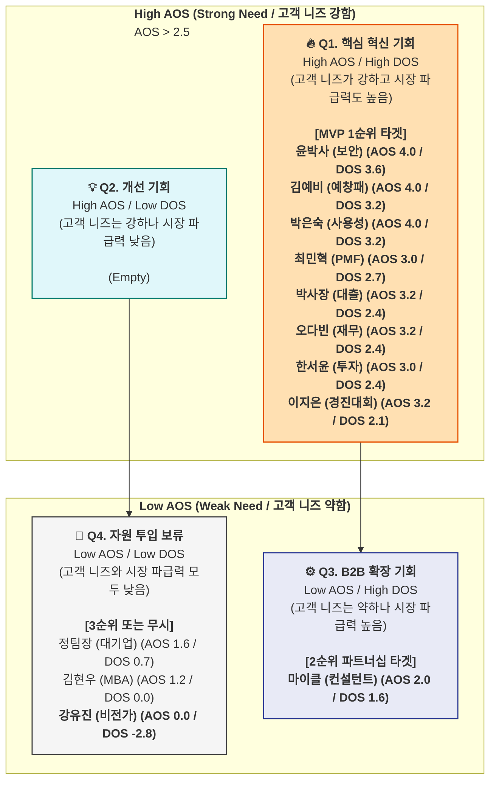

# SaaS 온라인 비즈니스 컨설팅의 AOS-DOS 매트릭스

### 1. DOS(Discovered Opportunity Score) 산출 근거

DOS를 계산하기 위해, 각 페르소나의 Pain/Goal이 전체 시장(TAM/SAM)에서 차지하는 **전략적 중요성(Market Relevance)**을 0.0에서 1.0 사이의 가중치로 부여했습니다.

- **Market Relevance (시장 파급력) 정의:**
    - **(높음: 0.8~0.9)** SAM의 핵심 다수(Q1, Q2 세그먼트)가 공통으로 겪는 문제이거나, 시장 진입/확장의 핵심 관문(Key Gate)이 되는 문제 (예: 정부 과제, PMF 검증, 보안)
    - **(중간: 0.6~0.7)** SAM의 일부 또는 확장 시장(Adjacent)에서 중요하게 다루는 문제 (예: 사내 벤처, 교육 시장)
    - **(낮음: 0.5 이하)** 특정 집단의 문제이거나, 시장 확산성이 낮은 문제 (예: 학업용)

### 2. AOS vs. DOS 통합 분석표

- **AOS (조정형 기회점수):** `Importance × (1 - Satisfaction / 5)` (고객 1명의 니즈 강도)
- **DOS (발견된 기회점수):** `(Importance - Satisfaction) × Market Relevance` (니즈의 시장 파급력)
- **AOS 기준:** 2.5 초과 시 'High' / 2.5 이하 시 'Low'
- **DOS 기준:** 1.5 초과 시 'High' / 1.5 이하 시 'Low'

| **페르소나 (유형)** | **Pain / Goal** | **Imp** | **Sat** | **AOS** | **Market Rel.** | **DOS** | **Quadrant** | **전략적 해석** |
| --- | --- | --- | --- | --- | --- | --- | --- | --- |
| **윤박사 (Non-user)** | 딥테크, **보안 불신** | 5 | 1 | **4.0** | 0.9 | **3.6** | **Q1** | **(1순위)** 기술 창업 시장(Q1) 전체를 열기 위한 **전제 조건**. |
| **김예비 (Core-Q2)** | **예창패 사업계획서** | 5 | 1 | **4.0** | 0.8 | **3.2** | **Q1** | **(1순위)** 가장 즉각적인 매출(Volume)을 발생시키는 핵심 시장. |
| **박은숙 (Extreme)** | 50대, **사용성(UX) 장벽** | 5 | 1 | **4.0** | 0.8 | **3.2** | **Q1** | **(1순위)** 모든 유저의 이탈을 막는, 제품의 핵심 경쟁력. |
| **최민혁 (Core-Q1)** | 재창업, **PMF 검증** | 5 | 2 | **3.0** | 0.9 | **2.7** | **Q1** | **(1순위)** 제품의 핵심 가치(Value)이자 '팬'을 만드는 핵심 기능. |
| **박사장 (Core-Q2)** | 은행 대출용 계획서 | 4 | 1 | **3.2** | 0.8 | **2.4** | **Q1** | **(1순위)** 예창패와 동일한 Q2(과제 수행) 시장의 핵심 축. |
| **오다빈 (Extreme)** | 아이디어 호퍼, **재무 블로커** | 4 | 1 | **3.2** | 0.8 | **2.4** | **Q1** | **(1순위)** 고객의 핵심 이탈 지점(Blocker)을 해결하는 필수 기능. |
| **한서윤 (Core-Q1)** | VC 투자 유치용 IR Deck | 5 | 2 | **3.0** | 0.8 | **2.4** | **Q1** | **(1순위)** Q1(학습자) 세그먼트의 핵심 목표. PMF 기능과 직결. |
| **이지은 (Core-Q2)** | 창업경진대회 1등 | 4 | 1 | **3.2** | 0.7 | **2.1** | **Q1** | **(1순위)** 미래 고객(B2G) 확보 및 Q2 시장의 초기 진입점. |
| **마이클 (Adjacent)** | 1인 컨설턴트, 진단 자동화 | 5 | 3 | **2.0** | 0.8 | **1.6** | **Q3** | (2순위) B2B2C 채널 파트너. 제품 출시 후 파트너십으로 공략. |
| **정팀장 (Adjacent)** | 대기업, 아이템 스크리닝 | 4 | 3 | **1.6** | 0.7 | **0.7** | **Q4** | (3순위) B2B Enterprise. 니즈가 낮아 초기 타겟에서 제외. |
| **김현우 (Adjacent)** | MBA, 기말 과제 | 3 | 3 | **1.2** | 0.5 | **0.0** | **Q4** | (3순위) B2G 교육 시장. 초기 타겟에서 제외. |
| **강유진 (Non-user)** | "직감" 중시, 데이터 불필요 | 1 | 5 | **0.0** | 0.7 | **-2.8** | **Q4** | **(무시)** 자원 투입 금지. Q3 세그먼트. |

---

### 3. AOS vs. DOS 기회 포트폴리오 (Mermaid)

---

### 4. 최종 전략 결론: MVP의 우선순위

AOS와 DOS의 교차 분석을 통해 매우 명확한 3단계 전략이 도출됩니다.

1. **Phase 1 (MVP 1순위): Q1 "핵심 혁신 기회"에 집중 (AOS & DOS 모두 높음)**
    - **Core SOM(Q1, Q2)과 Extreme 페르소나가 모두 Q1에 집중**되었습니다. 이는 우리가 정의한 시장이 니즈와 파급력 모두에서 '진짜 기회'임을 증명합니다.
    - **MVP는 반드시 이들의 Pain을 해결해야 합니다:**
        1. **보안(윤박사):** "온라인 SaaS는 믿을 수 없다"는 기술 창업가(Q1)의 핵심 장벽(Blocker)을 해소해야 합니다. (예: On-premise 옵션, 강력한 암호화, 기밀유지협약(NDA) 명시)
        2. **과제 해결(김예비/박사장):** '예창패', '은행 대출' 등 명확한 목적의 **템플릿과 자동 완성** 기능을 제공해야 합니다.
        3. **핵심 가치(최민혁/한서윤):** 'PMF 검증', 'IR 재무 추정' 등 Q1 세그먼트의 **핵심 가치를 제공**해야 합니다.
        4. **장벽 제거(박은숙/오다빈):** '쉬운 UX'와 '재무 자동화'는 선택이 아닌 **필수 기능**입니다.
2. **Phase 2 (확장): Q3 "B2B 확장 기회" 공략 (AOS 낮음 / DOS 높음)**
    - *'마이클(컨설턴트)'**은 본인의 니즈(AOS 2.0)는 중간이지만, 채널로서의 시장 파급력(DOS 1.6)이 높습니다.
    - **전략:** 제품 출시 후, 이들을 위한 **'컨설턴트용 파트너 프로그램'** (예: 클라이언트 관리 대시보드, 리브랜딩 기능)을 제공하여 B2B2C 채널로 활용합니다.
3. **Phase 3 (보류/무시): Q4 "자원 투입 보류" (AOS & DOS 모두 낮음)**
    - *'강유진(비전가)'**은 AOS 0.0, DOS -2.8로, 이들을 설득하려는 모든 노력(마케팅, 영업)이 낭비임을 명확히 보여줍니다. **(전략: 무시)**
    - *'정팀장(대기업)', '김현우(MBA)'**는 니즈 강도와 파급력이 모두 낮아 초기 MVP 타겟에서 명확히 제외합니다. **(전략: 보류)**

### 🚀 `종합 기회 평가표` (AOS vs. DOS)

이 분석은 **"고객이 이 문제를 얼마나 중요하게 생각하는가?(AOS)"**와 **"이 문제를 해결하는 것이 우리 비즈니스에 얼마나 큰 영향을 미치는가?(DOS)"**를 종합적으로 평가합니다.

**핵심 발견:**

- **Core(핵심) 및 Extreme(극단) 페르소나**는 모두 AOS와 DOS가 높은 **Q1(핵심 혁신 기회)** 영역에 집중되었습니다. 이는 우리가 정의한 SAM/SOM 시장이 MVP의 1순위 타겟임을 강력히 증명합니다.
- *'윤박사(보안)'**와 **'박은숙(사용성)'**의 DOS 점수가 가장 높은 것은, 이들의 Pain Point가 특정 개인의 문제가 아닌, 시장 진입 자체를 가로막는 **핵심 장벽(Blocker)**임을 의미합니다.

| **페르소나 (시장 세그먼트)** | **핵심 Pain / Goal** | **Imp** | **Sat** | **OS (참고)** | **AOS (니즈 강도)** | **Market Rel.(시장 파급력)** | **DOS (시장 기회)** | **최종 사분면(AOS vs DOS)** | **전략적 우선순위** |
| --- | --- | --- | --- | --- | --- | --- | --- | --- | --- |
| **윤박사 (Non-user)** | 딥테크, **보안 불신** | 5 | 1 | 9 | **4.0** | 0.9 | **3.6** | **Q1** | **MVP 1순위 (Blocker)** 기술 창업 시장 전체를 열기 위한 **전제 조건** |
| **김예비 (Core - Q2)** | **예창패** 사업계획서 | 5 | 1 | 9 | **4.0** | 0.8 | **3.2** | **Q1** | **MVP 1순위 (Volume)** 가장 즉각적인 매출을 발생시킬 핵심 타겟 |
| **박은숙 (Extreme)** | 50대, **사용성(UX) 장벽** | 5 | 1 | 9 | **4.0** | 0.8 | **3.2** | **Q1** | **MVP 1순위 (Blocker)** 모든 사용자의 이탈을 막는 핵심 경쟁력 |
| **최민혁 (Core - Q1)** | 재창업, **PMF 검증** | 5 | 2 | 8 | **3.0** | 0.9 | **2.7** | **Q1** | **MVP 1순위 (Value)** 제품의 핵심 가치이자 '팬'을 확보하는 기능 |
| **박사장 (Core - Q2)** | 은행 대출용 계획서 | 4 | 1 | 7 | **3.2** | 0.8 | **2.4** | **Q1** | **MVP 1순위 (Volume)** '예창패'와 동일한 Q2 시장의 중요 축 |
| **오다빈 (Extreme)** | 아이디어 호퍼, **재무 블로커** | 4 | 1 | 7 | **3.2** | 0.8 | **2.4** | **Q1** | **MVP 1순위 (Blocker)** 고객의 핵심 이탈 지점(포기)을 해결 |
| **한서윤 (Core - Q1)** | VC 투자 유치용 IR Deck | 5 | 2 | 8 | **3.0** | 0.8 | **2.4** | **Q1** | **MVP 1순위 (Value)** Q1(학습자) 세그먼트의 핵심 목표 |
| **이지은 (Core - Q2)** | 창업경진대회 1등 | 4 | 1 | 7 | **3.2** | 0.7 | **2.1** | **Q1** | **MVP 1순위 (B2G/Future)** 미래 고객 확보 및 초기 시장 진입점 |
| **마이클 (Adjacent)** | 1인 컨설턴트, 진단 자동화 | 5 | 3 | 7 | **2.0** | 0.8 | **1.6** | **Q3** | **2순위 (B2B 확장)** 니즈는 낮으나(AOS) 파급력이 높음. 채널 파트너로 활용. |
| **정팀장 (Adjacent)** | 대기업, 아이템 스크리닝 | 4 | 3 | 5 | **1.6** | 0.7 | **0.7** | **Q4** | **3순위 (보류)** B2B 확장 기회이나, 니즈와 파급력 모두 낮음 |
| **김현우 (Adjacent)** | MBA, 기말 과제 | 3 | 3 | 3 | **1.2** | 0.5 | **0.0** | **Q4** | **3순위 (보류)** 교육 시장. 초기 타겟에서 제외. |
| **강유진 (Non-user - Q3)** | "비전/직감"이 중요 | 1 | 5 | -3 | **0.0** | 0.7 | **-2.8** | **Q4** | **무시 (Anti-Persona)** 자원 투입 금지. |