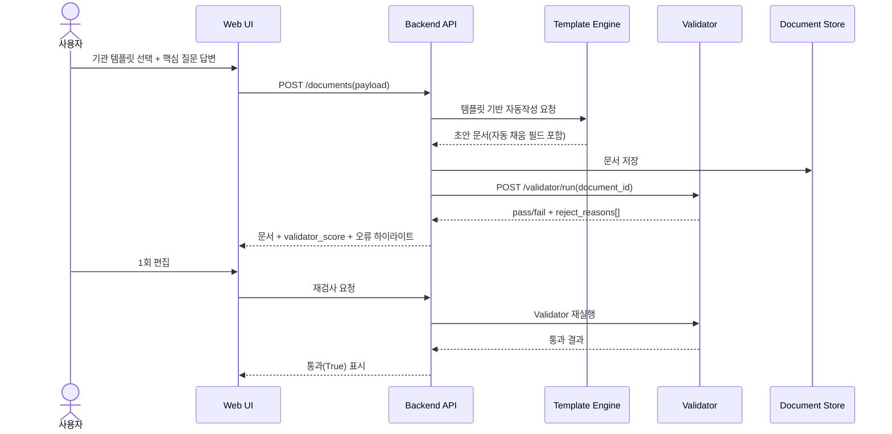
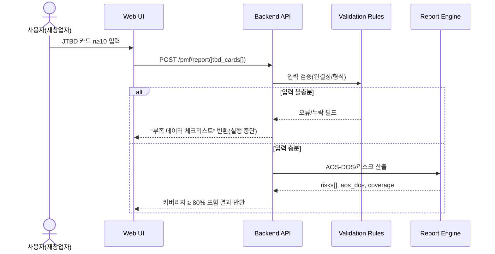
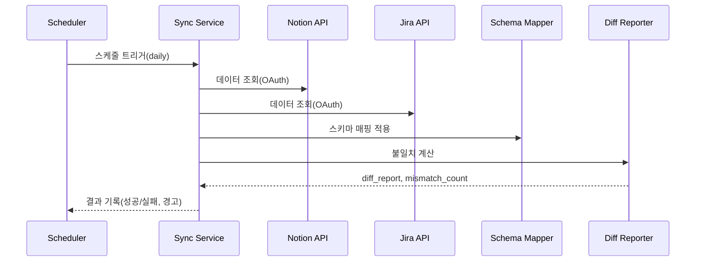
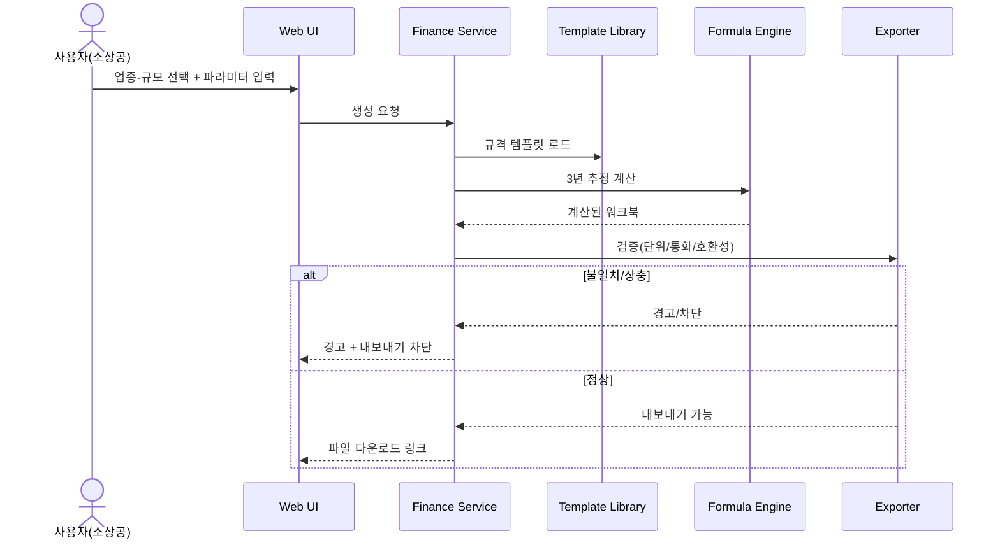

I'll set up a short task list to structure the SRS creation, then proceed to generate the full SRS from your PRD.

[1 tool called]

# Software Requirements Specification (SRS)

Document ID: SRS-001

Revision: 1.0

Date: 2025-11-14

Standard: ISO/IEC/IEEE 29148:2018

-------------------------------------------------

1. Introduction

   1.1 Purpose
   - 본 문서는 SaaS형 온라인 비즈니스 컨설팅 통합 솔루션의 소프트웨어 요구사항을 규정한다. PRD(@GPT-PRD2.md)를 유일한 요구사항 소스로 하며, 기관 양식 자동완성·Validator, Outcome 기반 PMF 진단, Notion/Jira ↔ 재무 싱크(읽기 전용), 은행/IR 재무 모델 템플릿 및 자동 채움, AOS-DOS 스코어링 및 마이그레이션 어시스턴트의 기능과 품질 특성을 정의한다. 요구사항은 테스트 가능하고 추적 가능해야 하며, 본 SRS는 개발, 검증, 운영 및 변경관리의 기준으로 사용된다.

   1.2 Scope (In-Scope / Out-of-Scope)
   - In-Scope
     - F1: 예창패/은행/IR 양식 자동완성 + Validator
     - F2: Outcome 기반 PMF 진단 리포트(AOS-DOS/JTBD 매핑)
     - F3(Phase 1): Notion/Jira ↔ 재무 계획 읽기 전용 싱크 및 diff 리포트
     - F4: 은행/IR 재무 모델 템플릿 & 자동 채움
     - F5: 데이터 마이그레이션 어시스턴트(CSV/Excel → 신규)
     - F6: AOS-DOS 스코어링 & 타겟 세그먼트 제안
   - Out-of-Scope
     - 외부 회계 SaaS와의 양방향 완전 통합
     - 모바일 네이티브 앱
     - 다국어(영어 외) 전체 UI 번역
     - 전면 OCR
     - 온프레 전용 배포(데이터 레지던시 옵션은 제공)

   1.3 Definitions, Acronyms, Abbreviations
   - JTBD: Jobs To Be Done. 고객이 달성하려는 과업을 구조화한 단위.
   - AOS/DOS: Adjusted/Discovered Opportunity Score. 세그먼트/가설 기회 점수.
   - Validator: 기관·양식별 규칙 기반 형식/필수/규격 검증기.
   - Template: 기관·버전별 문서/재무 모델의 구조·규칙 정의.
   - p95: 95퍼센타일 지연 또는 커버리지 등 통계 지표.
   - SLA: Service Level Agreement. 가용성·성능에 대한 합의 기준.
   - RPO/RTO: 복구 시점 목표/복구 시간 목표.
   - RBAC: Role-Based Access Control. 역할 기반 접근 통제.
   - OAuth: 외부 서비스 권한 부여 표준(예: Notion, Jira).
   - Diff Report: 싱크 시 실행 데이터와 재무 간 불일치 보고서.

   1.4 References (REF-XX)
   - REF-01: GPT-PRD/GPT-PRD2.md (본 SRS의 유일한 비즈니스/기능 요구 소스)
   - REF-02: 2_핵심예제 분석자료/GPT-ValueProPositionSheet/GPT-ValueProPositionSheet.md
   - REF-03: 2_핵심예제 분석자료/5_SaaS형_온라인_비즈니스_컨설팅_TAM-SAM-SOM_핵심_원인_Market_Segment_분석_보고서.md
   - REF-04: 2_핵심예제 분석자료/8-2_SaaS형_온라인_비즈니스_컨설팅_JTBD_가상인터뷰_결과지.md

2. Stakeholders
   - 예비창업자(김예비): 제출 문서 자동완성/Validator 통과. 관심사: 제출 호환성 100%, 리드타임 단축.
   - 재창업자(최민혁): Outcome 기반 PMF 진단. 관심사: 위험 가설 발견, 데이터 기반 의사결정.
   - 스위처(이대표): Notion/Jira ↔ 재무 읽기 전용 검증. 관심사: 실행-재무 불일치 0, 점진 통합.
   - 소상공(박사장): 은행 규격 재무 모델 템플릿 & 자동 채움. 관심사: 100% 호환, 단기간 완성.
   - IR 준비(한서윤): 덱↔재무 지표 동기. 관심사: 투자자 질의 대응 리드타임 단축.
   - 운영/템플릿 관리자: 기관 양식 레지스트리/Validator 룰 업데이트·버전링·롤백.

3. System Context and Interfaces

   3.1 External Systems
   - Notion API: 프로젝트/태스크 데이터 조회(OAuth).
   - Jira API: 이슈/스프린트 데이터 조회(OAuth).
   - OAuth 제공자: Notion/Jira 권한 부여 플로우.
   - Slack/Email: SLA 초과·운영 알림 채널.
   - 파일 소비자: 은행/IR 제출 시스템(파일 내보내기 기반, 직접 연동 아님).

   3.2 Client Applications
   - 웹 애플리케이션(브라우저 기반 UI).
   - 관리자 콘솔(템플릿·룰셋·버전 관리).

   3.3 API Overview
   - POST /documents: 템플릿/질문 답변 입력 → 초안 문서, validator_score 반환.
   - POST /validator/run: document_id → pass/fail, reject_reasons[].
   - POST /pmf/report: jtbd_cards[] → risks[], aos_dos, coverage.
   - POST /sync/run: connector_id → diff_report, mismatch_count.
   - GET /export: document_id, format → file(PDF/Excel).
   - 공통 제약: 요청 ≤ 10MB, 사용자별 60 rpm, OAuth 최소 스코프.

   3.4 Interaction Sequences (핵심)

4. Specific Requirements

   4.1 Functional Requirements

| ID | Title | Description | Priority | Source (Story/Feature) | Acceptance Criteria (Given/When/Then) | Related API/Module | Dependencies |
|---|---|---|---|---|---|---|---|
| REQ-FUNC-001 | 템플릿 선택 및 문서 생성 | 사용자가 기관·버전 템플릿을 선택하고 핵심 질답을 입력하면 초안 문서가 생성되어야 한다. | Must | Story 1, F1 | Given 템플릿 선택·질답 완료 When 문서 생성 Then 초안 생성 및 저장, 자동 채움 커버리지 p95 ≥ 85% | POST /documents, Template Engine, Document Store | 템플릿 레지스트리 |
| REQ-FUNC-002 | 자동완성 수행 | 템플릿 엔진은 규칙/룰셋/LLM을 사용해 필수 필드를 자동 채움한다. | Must | Story 1, F1 | Given 질답 When 자동작성 Then 필수 필드 자동 채움, 누락 필드 목록 포함 | Template Engine | Validator 룰셋 |
| REQ-FUNC-003 | Validator 실행 및 오류 하이라이트 | 문서에 대해 Validator를 실행하고 실패 시 누락/형식 오류를 하이라이트한다. | Must | Story 1, F1 | Given 필수 항목 누락 When Validator 실행 Then 통과=False, 오류 하이라이트 표시 ≤1s(UX), 사유 목록 제공 | POST /validator/run, Validator | 템플릿·룰셋 |
| REQ-FUNC-004 | 재검사 통과 | 1회 편집 후 재검사 시 형식/누락 오류가 0이어야 한다. | Must | Story 1, F1 | Given 1회 편집 When 재검사 Then 형식/누락 오류=0, 규격 검사 통과=True | Validator | — |
| REQ-FUNC-010 | PMF 진단 리포트 생성 | JTBD 카드 입력 기반으로 상위 3 위험 가설, AOS-DOS, 커버리지를 산출한다. | Must | Story 2, F2 | Given JTBD n≥10 When 진단 실행 Then Top3 위험+근거 링크, 커버리지 ≥ 80% | POST /pmf/report | JTBD 스키마 |
| REQ-FUNC-011 | 입력 불충분 차단 | 입력이 부족/형식 오류인 경우 실행을 중단하고 “부족 데이터 체크리스트”를 제공한다. | Must | Story 2, F2 | Given 입력 불완전 When 진단 실행 Then 체크리스트 표시, 부분 결과 미출력 | POST /pmf/report | 입력 검증기 |
| REQ-FUNC-020 | Notion/Jira OAuth 연결 | 사용자는 Notion/Jira 커넥터를 OAuth로 연결할 수 있어야 한다. | Could | Story 3, F3 | Given OAuth 유효 When 연결 저장 Then 커넥터 상태=연결됨, 최소 스코프만 사용 | Connector Service | OAuth |
| REQ-FUNC-021 | 일일 스케줄 싱크 | 시스템은 일일 스케줄로 읽기 전용 싱크를 수행해야 한다. | Could | Story 3, F3 | Given 스케줄 설정 When 스케줄 시간 Then 싱크 실행 기록 생성 | POST /sync/run, Scheduler | 커넥터 |
| REQ-FUNC-022 | diff 리포트 생성 | 싱크 결과 불일치를 계산하여 diff 리포트와 mismatch_count를 제공한다. | Could | Story 3, F3 | Given 커넥터 정상 When 싱크 Then diff_report 생성, mismatch_count 보고 | POST /sync/run, Diff Reporter | 스키마 매퍼 |
| REQ-FUNC-023 | 충돌 경고 및 반영 차단 | 스키마 충돌/권한 오류 시 경고를 생성하고 재무 반영을 차단한다. | Could | Story 3, F3 | Given 충돌/권한 오류 When 싱크 Then 충돌 유형·필드 경고, 재무 반영 차단 | Sync Service | 권한 검증 |
| REQ-FUNC-030 | 은행/IR 템플릿 생성 | 업종·규모 선택 시 제출 양식(워크북/시트/항목) 100% 호환 템플릿 생성. | Must | Story 4, F4 | Given 업종·규모 When 생성 Then 제출 양식 100% 호환 확인 | Template Library, GET /export | 수식 엔진 |
| REQ-FUNC-031 | 3년 추정 자동 생성 | 기본 매개변수 입력 시 3년 추정 값을 자동 생성한다. | Must | Story 4, F4 | Given 파라미터 When 생성 Then 3년 추정 생성, 계산 검증 통과 | 수식 엔진 | 템플릿 |
| REQ-FUNC-032 | 단위/통화 불일치 차단 | 단위/통화 상충 시 경고하고 제출 내보내기를 차단한다. | Must | Story 4, F4 | Given 상충 단위 When 생성/내보내기 Then 경고 표시 및 내보내기 차단 | Export Service | 검증 규칙 |
| REQ-FUNC-040 | 마이그레이션 파서 | Notion/Excel CSV를 파싱하여 매핑 규칙을 구성하고 미리보기를 제공한다. | Could | F5 | Given CSV 업로드 When 매핑 구성 Then 필드 매핑 및 미리보기 제공 | Migration Assistant | 파서 |
| REQ-FUNC-041 | 전환 검증 리포트 | 매핑 품질·누락·충돌을 요약한 검증 리포트를 제공한다. | Could | F5 | Given 매핑 완료 When 검증 실행 Then 오류/경고/권고 포함 리포트 제공 | Migration Assistant | 검증기 |
| REQ-FUNC-050 | AOS-DOS 스코어링 | 입력 데이터로 세그먼트 AOS-DOS 스코어를 계산하고 상위 제안을 제공한다. | Should | F6 | Given 입력 데이터 When 스코어링 Then 상위 세그먼트 제안 반환 | Scoring Engine | 세그먼트 맵 |
| REQ-FUNC-060 | 템플릿/룰셋 버전 관리 | 기관 양식·룰셋을 버전링·롤백 가능하게 관리한다. | Must | R2, F1/F4 | Given 새 버전 등록 When 배포 Then 선택적 롤백 가능, 문서에 version 반영 | Template Registry | 관리자 콘솔 |
| REQ-FUNC-061 | 운영 알림 | SLA 초과/에러율 증가 시 Slack/Email로 알림을 발송한다. | Must | 모니터링, 5장 | Given 임계치 초과 When 감지 Then 실시간 알림 전송 | Monitoring/Alerting | 메트릭 수집기 |

   4.2 Non-Functional Requirements

| ID | Category | Requirement | Target/Metric | Source | Verification |
|---|---|---|---|---|---|
| REQ-NF-001 | Performance | Validator 백엔드 p95 응답 | ≤ 800ms | PRD §5 | 부하 테스트(10k req), p95 기록 |
| REQ-NF-002 | Performance | 문서 자동작성 p95 | ≤ 4s | PRD §5 | 시나리오 테스트 |
| REQ-NF-003 | Performance | PMF 리포트 p95 | ≤ 4s | PRD §5 | 부하 테스트 |
| REQ-NF-004 | Performance | 싱크 diff p95(50k 레코드) | ≤ 60s | PRD §5 | 대용량 데이터 테스트 |
| REQ-NF-005 | Performance | 재무 모델 생성 p95 | ≤ 2s | PRD §5 | 성능 테스트 |
| REQ-NF-006 | UX Latency | Validator 응답 UX p95 | ≤ 1.0s | Story 1 AC | E2E 측정(브라우저 RUM) |
| REQ-NF-010 | Reliability | 월 가용성 | ≥ 99.9% | PRD §5 | SLO 리포트 |
| REQ-NF-011 | Reliability | 백엔드 오류율 | ≤ 0.5% | PRD §5 | 에러 비율 모니터링 |
| REQ-NF-012 | Reliability | 싱크 성공률(월) | ≥ 99.0% | PRD §5 | 작업 성공 통계 |
| REQ-NF-013 | Resilience | RPO/RTO | RPO ≤ 1h, RTO ≤ 30m | PRD §5 | DR 리허설 |
| REQ-NF-020 | Security | 전송 암호화 | TLS 1.2+ | PRD §5 | SSL Labs 검사 |
| REQ-NF-021 | Security | 저장 암호화/분리 | AES-256, 민감정보 분리 저장 | PRD §5 | 구성/키 관리 점검 |
| REQ-NF-022 | Security | RBAC 적용 | 역할별 최소 권한 | PRD §5 | 접근 시나리오 테스트 |
| REQ-NF-023 | Security | 감사 로그 보존 | ≥ 1년 | PRD §5 | 로그 보존 정책 점검 |
| REQ-NF-024 | Compliance | 국내 리전 옵션 | 제공 | ADR-001 | 배포 설정 확인 |
| REQ-NF-030 | Cost | 문서 1건 자동작성·검증 변동비 | ≤ $0.10 | PRD §5 | 비용 대시보드 |
| REQ-NF-031 | Cost | 일 1k 문서 월 예산 준수 | 경보 임계치 설정 | PRD §5 | 예산 초과 알림 |
| REQ-NF-040 | Observability | 메트릭 노출 | pass/fail, reject_reason, generation_ms, report_ms | PRD §5 | 프로메테우스 지표 |
| REQ-NF-041 | Observability | 싱크/커넥터 지표 | sync_success_rate, mismatch_count, connector_error_rate | PRD §5 | 대시보드 |
| REQ-NF-042 | Observability | 비용/스토리지 지표 | cost_per_doc, storage_gb | PRD §5 | 대시보드 |
| REQ-NF-043 | Alerting | SLA 초과 실시간 알림 | Slack/Email 발송 | PRD §5 | 알림 테스트 |
| REQ-NF-050 | Scalability | 사용자별 레이트리밋 | 60 rpm/user | PRD §6 | 부하/스로틀 테스트 |
| REQ-NF-051 | Scalability | 요청 크기 제한 | ≤ 10MB | PRD §6 | API 게이트웨이 검사 |
| REQ-NF-060 | Maintainability | 템플릿/룰셋 버전링·롤백 | 지원 | R2/ADR-002 | 변경 리허설 |
| REQ-NF-061 | Maintainability | ADR 프로세스 | ADR-001..003 반영 | PRD §7 | 아키텍처 리뷰 |

5. Traceability Matrix

| Story | Requirement IDs | Test Case IDs |
|---|---|---|
| Story 1 (예비창업자) | REQ-FUNC-001, -002, -003, -004; REQ-NF-001, -006 | TC-FUNC-001..004, TC-NF-001, TC-NF-006 |
| Story 2 (재창업자) | REQ-FUNC-010, -011; REQ-NF-003 | TC-FUNC-010, TC-FUNC-011, TC-NF-003 |
| Story 3 (스위처) | REQ-FUNC-020, -021, -022, -023; REQ-NF-004, -012 | TC-FUNC-020..023, TC-NF-004, TC-NF-012 |
| Story 4 (소상공) | REQ-FUNC-030, -031, -032; REQ-NF-005 | TC-FUNC-030..032, TC-NF-005 |

6. Appendix

   6.1 API Endpoint List

| Method | Path | Request (요지) | Response (요지) | Constraints |
|---|---|---|---|---|
| POST | /documents | {institution, template_version, answers[]} | {document_id, draft, validator_score} | ≤10MB, 60 rpm |
| POST | /validator/run | {document_id} | {pass:bool, reject_reasons[]} | p95 ≤ 800ms(백엔드) |
| POST | /pmf/report | {jtbd_cards[]} | {risks[], aos_dos, coverage} | p95 ≤ 4s |
| POST | /sync/run | {connector_id} | {diff_report, mismatch_count} | p95 ≤ 60s(50k) |
| GET | /export | {document_id, format:pdf|xlsx} | file(stream) | 단위/통화 상충 시 차단 |

   6.2 Entity & Data Model

| Entity | Key Fields |
|---|---|
| Document | id:string, institution:string, template_version:string, sections:array, status:string, validator_score:number |
| Template | id:string, institution:string, version:string, required_fields:array, ruleset_id:string |
| ValidatorRule | id:string, institution:string, field:string, pattern:string, severity:string |
| JTBDCard | id:string, persona:string, job:string, pain:string, signals:array, aos:number, dos:number |
| OutcomeMetric | id:string, name:string, baseline:number, target:number, period:string, source:string |
| Experiment | id:string, hypothesis:string, design:string, metrics:array, success_criteria:string |
| SyncConnector | id:string, source:string(“Notion”|“Jira”), schema_map:object, last_run_at:datetime, success_rate:number |
| FinancialModel | id:string, industry:string, size:string, assumptions:array, outputs:object, export_refs:array |

   6.3 Detailed Interaction Models

   - PMF 진단 리포트 생성

   - 읽기 전용 싱크 & diff 리포트

   - 재무 템플릿 생성·검증·내보내기

— End of SRS —

Status: I parsed the PRD and drafted all sections of the SRS, including functional/non-functional requirements, API/data models, and the required Mermaid sequence diagrams. Next, I’ll mark tasks complete.