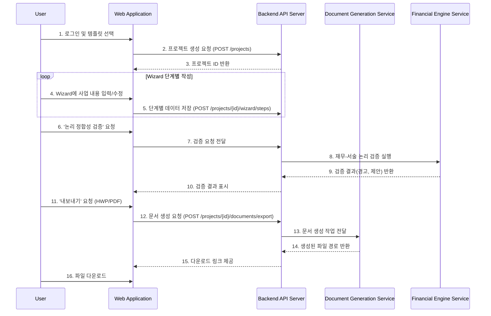
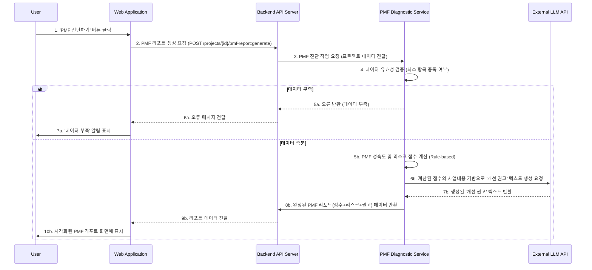

# Software Requirements Specification (SRS)
Document ID: SRS-001-Gemini
Revision: 1.0
Date: 2025-11-18
Standard: ISO/IEC/IEEE 29148:2018
-------------------------------------------------
## 1. Introduction

### 1.1 Purpose
초보 창업가는 자금 확보(정부 지원 사업, 은행 대출 등) 과정에서 사업계획서 작성이라는 큰 장벽에 직면합니다. 전문 지식 부족, 복잡한 양식, 객관적 근거를 갖춘 재무 추정의 어려움으로 인해 많은 창업가가 서류 미비 또는 논리적 허점을 이유로 탈락의 고배를 마십니다. 또한, 자금 확보 이후에도 '시장 수요 부재'나 '성급한 확장'과 같은 문제로 인해 실패하는 비율이 높습니다.

본 SRS가 정의하는 "AI Co-Pilot for First-time Founders" 소프트웨어는 이러한 문제 해결을 목표로 합니다. 복잡하고 막막한 사업 기획 과정을 '실패 확률을 낮추는 데이터 기반 의사결정 과정'으로 전환하여, 창업가가 자금 확보의 첫 관문을 신속하게 통과하고 비즈니스의 본질에 집중하여 지속 가능한 성장을 이룰 수 있도록 돕는 '지능형 사업 성공 파트너'를 개발하는 것이 본 시스템의 목적입니다.

### 1.2 Scope (In-Scope / Out-of-Scope)

#### 1.2.1 In-Scope
- 정부/은행 제출용 한글 사업계획서 Wizard 기능 (예비창업패키지 등 2~3개 대표 공고 템플릿 포함)
- HWP/PDF 형식으로 문서 내보내기 기능 (기본 레이아웃 및 스타일 포함)
- 핵심 변수 기반의 12개월 시나리오 재무 자동화 엔진 (기본 손익계산서)
- AI를 활용한 사업계획서 항목별 초안 생성 기능
- 사용자의 전문성 수준에 따른 '쉬운 모드'와 '전문가 모드' 편집기
- PMF(Product-Market Fit) 진단 리포트 생성 기능 (점수, 리스크, 권고 사항 포함)

#### 1.2.2 Out-of-Scope
- PMF 및 IR(Investor Relations) 통합 대시보드 UI (단, 데이터 스키마는 설계 범위에 포함)
- Notion, Jira, 외부 회계 툴과의 양방향 동기화 기능
- 2인을 초과하는 사용자를 위한 실시간 팀 협업 기능
- 컨설턴트, 액셀러레이터(AC), 벤처캐피탈(VC)을 위한 B2B 대시보드 기능

### 1.3 Definitions, Acronyms, Abbreviations
| 용어 | 정의 |
| :--- | :--- |
| **AC** | Acceptance Criteria (인수 기준) |
| **AI Co-Pilot** | 본 시스템의 명칭, 인공지능 사업 성공 파트너 |
| **CAC** | Customer Acquisition Cost (고객 획득 비용) |
| **GTM**| Go-to-Market (시장 출시 전략) |
| **JTBD** | Jobs-to-be-Done (완수해야 할 과업) |
| **LTV** | Lifetime Value (고객 생애 가치) |
| **MSCW** | Must, Should, Could, Won't (요구사항 우선순위 결정 기법) |
| **NFR** | Non-Functional Requirement (비기능 요구사항) |
| **NPS** | Net Promoter Score (고객 순추천지수) |
| **PMF** | Product-Market Fit (제품-시장 적합성) |
| **PRD**| Product Requirements Document (제품 요구사항 문서) |
| **SLA** | Service Level Agreement (서비스 수준 협약) |
| **SRS** | Software Requirements Specification (소프트웨어 요구사항 명세서) |
| **TTV**| Time-to-Value (가치 확인 시간) |
| **Wizard** | 사용자를 단계별로 안내하여 과업을 완료하도록 돕는 인터페이스 |

### 1.4 References (REF-XX)
| ID | 문서명 | 링크/위치 |
| :--- | :--- | :--- |
| **REF-01** | PRD: AI Co-Pilot for First-time Founders V1.0 | `2_핵심예제_분석자료/9_GPT-Gemini_Merged_PRD.md` |
| **REF-02** | JTBD 가상 인터뷰 결과지 V2 | `2_핵심예제_분석자료/8-2_SaaS형_온라인_비즈니스_컨설팅_JTBD_가상인터뷰_결과지_V2.md` |
| **REF-03** | 통합 가치 제안서 | `2_핵심예제_분석자료/8-3_Gemini-GPT_Merged_ValueProposition.md` |
| **REF-04** | CB Insights - Startup Failure Post-Mortems | 외부 벤치마크 리포트 |

## 2. Stakeholders
| 역할 (Role) | 설명 | 핵심 관심사 (Interest) |
| :--- | :--- | :--- |
| **김예비 (예비창업자)** | IT 비전공자로, 정부 지원 사업(예: 예비창업패키지)에 처음 도전하는 창업가. | - 복잡한 사업계획서 양식을 쉽게 완성하는 것. - 재무 파트의 오류를 줄이고 자신감을 얻는 것. |
| **박사장 (소상공인)** | 오프라인 매장 운영 중 디지털 전환 및 확장을 위해 은행 정책자금을 신청하려는 자영업자. | - 컨설팅 비용과 시간을 절약하는 것. - 매출 추정 근거를 논리적으로 설명하는 것. |
| **최민혁 (재도전 창업가)** | 과거 PMF 검증 실패로 사업 중단 경험이 있으며, 이번에는 데이터 기반으로 사업을 확장하려는 창업가. | - 지표-재무-PMF 간 논리적 일관성을 확보하는 것. - 가설을 체계적으로 관리하고 검증하는 것. |
| **Product & Founders Success Team** | 본 시스템의 기획 및 개발을 책임지는 내부 조직. | - 제품 목표 달성 및 성공 지표 관리. - 사용자의 Pain Point를 해결하여 높은 가치를 제공하는 것. |

## 3. System Context and Interfaces

### 3.1 External Systems
- **LLM Provider (Gemini/GPT):** 사업계획서 초안 생성, 문장 구조화 등 자연어 처리 기능을 위해 외부 LLM API와 연동한다.
- **HWP/PDF Converter:** 사용자가 작성한 문서를 HWP 또는 PDF 파일 형식으로 변환하기 위한 외부 솔루션과 연동한다.
- **정부/은행 공고 시스템:** 직접적인 연동은 없으나, 해당 시스템의 공고 양식을 템플릿으로 반영해야 한다.

### 3.2 Client Applications
- **Web Application:** 사용자는 최신 웹 브라우저를 통해 시스템의 모든 기능에 접근한다. 반응형 웹 디자인을 통해 데스크톱 및 태블릿 환경을 지원한다.

### 3.3 API Overview
시스템은 내부적으로 Microservice Architecture를 기반으로 하며, 주요 기능은 RESTful API를 통해 제공된다.
- **Project Management API:** 프로젝트 생성, 수정, 삭제 등 관리 기능 제공
- **Wizard API:** 단계별 사용자 입력 저장 및 상태 관리 기능 제공
- **Document Generation API:** 사업계획서, PMF 리포트 등 산출물 생성 요청 처리
- **Financial Engine API:** 재무 모델 계산 및 논리 검증 기능 제공
- **User Management API:** 사용자 인증 및 권한 관리

### 3.4 Interaction Sequences (핵심 시퀀스 다이어그램)
사용자의 핵심적인 사업계획서 작성 흐름은 다음과 같다.

## 4. Specific Requirements

### 4.1 Functional Requirements

| ID | 기능명 | Source (User Story) | Priority | Acceptance Criteria |
| :--- | :--- | :--- | :--- | :--- |
| **REQ-FUNC-001** | **템플릿 선택 기능** | EPIC 1: 과제 통과 Job | Must | **Given** 사용자가 로그인 후 대시보드에 진입했을 때, **When** '새 프로젝트 시작'을 클릭하면, **Then** '예비창업패키지'를 포함한 최소 2개 이상의 정부/은행 과제 템플릿 목록이 표시되어야 한다. |
| **REQ-FUNC-002** | **Wizard 기반 정보 입력 UI** | EPIC 1: 과제 통과 Job F1: 한글 Wizard | Must | **Given** 사용자가 특정 템플릿을 선택했을 때, **When** 프로젝트가 생성되면, **Then** 선택된 템플릿의 목차에 따라 단계별로 정보를 입력할 수 있는 Wizard 형태의 UI가 제공되어야 한다. |
| **REQ-FUNC-003** | **AI 초안 생성** | EPIC 1: 과제 통과 Job F4: AI 초안 생성 | Must | **Given** 사용자가 Wizard의 특정 입력 항목(예: 문제 정의)에 있고, **When** 'AI로 초안 작성' 버튼을 클릭하면, **Then** 시스템은 이전에 입력된 정보를 바탕으로 해당 항목에 대한 초안 텍스트를 10초 이내에 생성하여 제시해야 한다. |
| **REQ-FUNC-004** | **편집기 모드 전환** | F4: 쉬운 모드↔전문가 모드 | Must | **Given** 사용자가 Wizard에서 텍스트를 편집하고 있을 때, **When** '모드 전환' 토글을 클릭하면, **Then** UI는 핵심 질문에만 답변하는 '쉬운 모드'와 상세 서술이 가능한 '전문가 모드' 간에 즉시 전환되어야 한다. |
| **REQ-FUNC-005** | **템플릿 양식 100% 반영** | AC 1.1 | Must | **Given** 사용자가 '예비창업패키지' 템플릿을 선택하여 작성을 완료했을 때, **When** 최종 결과물을 생성하면, **Then** 생성된 문서는 해당 공고 양식의 필수 항목 및 목차를 100% 포함해야 하며, 누락률은 0%여야 한다. |
| **REQ-FUNC-006** | **제출 가능성 자동 점검** | AC 1.2 | Must | **Given** 사업계획서 초안이 생성된 상태에서, **When** "제출 가능성 점검" 기능을 실행하면, **Then** 시스템은 '문제 정의', '시장 분석' 등 10개 이상의 핵심 항목에 대해 충족 여부(✔/✖)와 보완 가이드를 포함한 체크리스트를 제시해야 한다. |
| **REQ-FUNC-007** | **재무-서술 논리 정합성 검증** | AC 1.3 F3: 재무 자동화 엔진 | Must | **Given** 사용자가 매출, 비용 등 재무 가정을 입력했고, 시장 규모, 가격 정책을 서술했을 때, **When** "논리 정합성 검증" 기능을 실행하면, **Then** 시스템은 PMF, 시장 규모, 가격, 재무 가정 간의 불일치를 탐지하여 최소 3건 이상의 구체적인 경고와 수정 제안을 표시해야 한다. |
| **REQ-FUNC-008** | **필수 입력 항목 누락 처리** | AC 1.4 | Must | **Given** 사용자가 필수 입력 필드(예: 월간 순이익)를 비워둔 상태에서, **When** 다음 단계로 이동하거나 저장을 시도하면, **Then** "필수 항목이 누락되었습니다"라는 알림을 표시하고 해당 필드로 포커스를 자동 이동시켜야 한다. |
| **REQ-FUNC-009** | **HWP/PDF/DOCX 내보내기** | F2: HWP/PDF 내보내기 | Must | **Given** 사용자가 문서 작성을 완료했을 때, **When** '내보내기' 버튼을 클릭하고 'HWP' 또는 'PDF' 형식을 선택하면, **Then** 시스템은 해당 포맷으로 변환된 파일을 사용자가 다운로드할 수 있도록 제공해야 한다. |
| **REQ-FUNC-010** | **PMF 진단 리포트 생성** | EPIC 2: 실패 회피 Job AC 2.1 F5: PMF 진단 | Should | **Given** 사용자가 사업 아이템, 타겟 고객 등 PMF 진단을 위한 최소 10개의 필수 질문에 답변했을 때, **When** "PMF 진단하기" 버튼을 클릭하면, **Then** 시스템은 PMF 성숙도 단계, 최소 3개 이상의 핵심 리스크, 개선 권고 사항을 포함한 리포트를 5분 이내에 생성해야 한다. |
| **REQ-FUNC-011** | **PMF 진단 데이터 부족 처리** | AC 2.3 | Should | **Given** 사용자가 PMF 진단을 위한 필수 질문에 5개 이하만 답변한 상태에서, **When** "PMF 진단하기"를 요청하면, **Then** 시스템은 "데이터 부족으로 신뢰도 높은 진단이 불가합니다"라는 메시지와 함께 추가로 필요한 최소 항목 목록과 예상 소요 시간을 안내해야 한다. |
| **REQ-FUNC-012** | **유닛 이코노믹스 시각화** | AC 2.2 | Should | **Given** 사용자가 CAC, ARPU, 이탈률 등 가설 수치를 입력했을 때, **When** "유닛 이코노믹스 보기"를 클릭하면, **Then** 시스템은 LTV/CAC 비율과 손익분기점 시점을 시각화된 차트로 제시해야 한다. |
| **REQ-FUNC-013** | **유닛 이코노믹스 위험 경고** | AC 2.2 | Should | **Given** 유닛 이코노믹스 차트가 표시된 상태에서, **When** 계산된 LTV/CAC 비율이 1 미만이거나 손익분기점이 36개월 이상일 경우, **Then** 시스템은 해당 지표를 적색으로 강조 표시하고, 가정을 조정하도록 제안하는 경고 메시지를 표시해야 한다. |
| **REQ-FUNC-014** | **On-premise/Private Cloud 배포 옵션** | F6: 보안 옵션 | Should | **Given** 기업 고객이 시스템 도입을 검토할 때, **When** 보안 요건으로 데이터의 외부 저장을 금지하는 경우, **Then** 시스템은 고객사의 자체 서버(On-premise) 또는 프라이빗 클라우드 환경에 설치하여 운영할 수 있는 배포 옵션을 제공해야 한다. |

### 4.2 Non-Functional Requirements

| ID | 구분 | 요구사항 | 임계치 및 측정 기준 |
| :--- | :--- | :--- | :--- |
| **REQ-NF-001** | **성능** | **TTV (Time-to-Value)** | 사용자가 가입 후 첫 '내보내기' 기능으로 제출 가능한 수준의 사업계획서 초안을 완성하는 데 걸리는 시간의 중앙값이 **30분 이하**여야 한다. |
| **REQ-NF-002** | **성능** | **Wizard 응답 시간** | Wizard의 각 단계(Step)를 전환할 때의 서버 응답 시간은 **p95 기준 800ms 이하**여야 한다. |
| **REQ-NF-003** | **성능** | **문서/리포트 생성 시간** | AI 초안, PMF 리포트, 최종 문서(HWP/PDF) 생성 요청에 대한 서버 처리 시간은 **p95 기준 10초 이하**여야 한다. |
| **REQ-NF-004** | **가용성** | **서비스 가용성 (SLA)** | 시스템의 월간 가용성은 **99.5% 이상**이어야 한다 (월 총 장애 시간 3.6시간 미만). |
| **REQ-NF-005** | **신뢰성**| **오류율** | 핵심 기능(Wizard 저장, 문서 생성, PMF 진단)의 서버 측 오류율은 **0.5% 이하**여야 한다. |
| **REQ-NF-006** | **신뢰성**| **데이터 보존 (자동 저장)** | 사용자가 Wizard에 내용을 입력할 때, 시스템은 **10초 이내**의 주기로 입력 내용을 자동으로 서버에 저장해야 한다. |
| **REQ-NF-007** | **보안**| **데이터 암호화** | 사용자가 입력하는 모든 민감 정보(사업 아이템, 재무 데이터 등)는 데이터베이스 저장 시 **AES-256** 표준으로 암호화되어야 한다. |
| **REQ-NF-008** | **보안**| **데이터 격리** | 각 사용자(테넌트)의 데이터는 논리적으로 완벽히 격리되어 다른 사용자가 접근할 수 없어야 한다. |
| **REQ-NF-009** | **확장성**| **템플릿 확장 유연성** | 새로운 정부/은행의 사업계획서 템플릿을 시스템에 추가해야 할 경우, 관리자 도구를 통해 **3일 이내**에 신규 템플릿을 반영할 수 있어야 한다. |
| **REQ-NF-010** | **비용**| **AI API 호출 비용 관리** | 과도한 비용 발생을 방지하기 위해, 사용자당 월별 LLM API 호출량을 제한(예: 10만 토큰)하고, 임계치 도달 시 알림을 보내는 기능이 있어야 한다. (측정: OpenAI/Gemini API 대시보드) |
| **REQ-NF-011** | **운영/모니터링** | **장애 알림** | 5분 단위 시스템 오류율이 1%를 초과하거나, p95 응답 시간이 2초를 초과하는 경우, 시스템은 On-call 담당자에게 자동으로 알림(Slack, SMS 등)을 보내야 한다. |
| **REQ-NF-012** | **사용성**| **Activation Rate** | 신규 가입 사용자가 첫 세션 내에 '제출 가능' 수준의 산출물을 완성하는 비율이 **40% 이상**이어야 한다. |
| **REQ-NF-013** | **사용성**| **NPS (고객만족도)** | 비전문가 사용자를 대상으로 3회 이상 사용 후 측정한 고객 순추천지수(NPS)는 **40 이상**이어야 한다. |

## 5. Traceability Matrix

| Source (User Story) | Requirement ID | Test Case ID (예시) |
| :--- | :--- | :--- |
| EPIC 1: 과제 통과 Job | REQ-FUNC-001, REQ-FUNC-002, REQ-FUNC-003, REQ-FUNC-005 | TC-FUNC-001, TC-FUNC-002 |
| AC 1.1 | REQ-FUNC-005 | TC-FUNC-005 |
| AC 1.2 | REQ-FUNC-006 | TC-FUNC-006 |
| AC 1.3 | REQ-FUNC-007 | TC-FUNC-007 |
| AC 1.4 | REQ-FUNC-008 | TC-FUNC-008 |
| EPIC 2: 실패 회피 Job | REQ-FUNC-010 | TC-FUNC-010 |
| AC 2.1 | REQ-FUNC-010 | TC-FUNC-010 |
| AC 2.2 | REQ-FUNC-012, REQ-FUNC-013 | TC-FUNC-012, TC-FUNC-013 |
| AC 2.3 | REQ-FUNC-011 | TC-FUNC-011 |
| F1: 한글 Wizard | REQ-FUNC-002 | TC-FUNC-002 |
| F2: HWP/PDF 내보내기 | REQ-FUNC-009 | TC-FUNC-009 |
| F3: 재무 자동화 엔진 | REQ-FUNC-007 | TC-FUNC-007 |
| F4: AI 초안 생성 | REQ-FUNC-003, REQ-FUNC-004 | TC-FUNC-003, TC-FUNC-004 |
| F5: PMF 진단 | REQ-FUNC-010, REQ-FUNC-011 | TC-FUNC-010, TC-FUNC-011 |
| F6: 보안 옵션 | REQ-FUNC-014 | TC-SEC-001 |

## 6. Appendix

### 6.1 API Endpoint List

| Method | Endpoint | 설명 |
| :--- | :--- | :--- |
| `POST` | `/users/register` | 사용자 회원가입 |
| `POST` | `/users/login` | 사용자 로그인 |
| `POST` | `/projects` | 새 사업 프로젝트 생성 |
| `GET` | `/projects/{id}` | 특정 프로젝트 정보 조회 |
| `POST` | `/projects/{id}/wizard/steps` | Wizard의 특정 단계 데이터 저장 |
| `GET` | `/projects/{id}/wizard/steps/{step_id}` | 특정 단계 데이터 조회 |
| `POST` | `/projects/{id}/documents/business-plan:generate` | 사업계획서 초안 텍스트 생성 (AI) |
| `POST` | `/projects/{id}/logic-validation:run` | 재무-서술 논리 정합성 검증 실행 |
| `POST` | `/projects/{id}/pmf-report:generate` | PMF 진단 리포트 생성 |
| `GET` | `/projects/{id}/export?format=[hwp\|pdf\|docx]` | 최종 문서를 지정된 포맷으로 내보내기 |

### 6.2 Entity & Data Model

**`User` Table**
| Column | Data Type | Description |
| :--- | :--- | :--- |
| `user_id` | UUID | Primary Key |
| `email` | VARCHAR(255) | 사용자 이메일 (로그인 ID) |
| `password_hash` | VARCHAR(255) | 해시된 비밀번호 |
| `user_type` | VARCHAR(50) | 사용자 페르소나 (예: 예비창업자) |
| `created_at`| TIMESTAMP | 계정 생성 일시 |

**`Project` Table**
| Column | Data Type | Description |
| :--- | :--- | :--- |
| `project_id` | UUID | Primary Key |
| `user_id` | UUID | Foreign Key to `User` |
| `project_name`| VARCHAR(255) | 프로젝트명 |
| `template_id` | VARCHAR(100)| 사용된 사업계획서 템플릿 ID |
| `created_at`| TIMESTAMP | 프로젝트 생성 일시 |
| `updated_at`| TIMESTAMP | 마지막 수정 일시 |

**`Document` Table**
| Column | Data Type | Description |
| :--- | :--- | :--- |
| `document_id` | UUID | Primary Key |
| `project_id` | UUID | Foreign Key to `Project` |
| `content` | JSONB | Wizard 각 단계별 입력 내용 |
| `version` | INT | 문서 버전 |
| `last_saved_at` | TIMESTAMP | 마지막 저장 일시 |

**`FinancialModel` Table**
| Column | Data Type | Description |
| :--- | :--- | :--- |
| `financial_model_id` | UUID | Primary Key |
| `project_id` | UUID | Foreign Key to `Project` |
| `assumptions` | JSONB | 매출, 비용, 성장률 등 핵심 재무 가정 |
| `pnl_statement`| JSONB | 자동 생성된 손익계산서 데이터 |
| `cash_flow` | JSONB | 자동 생성된 현금흐름표 데이터 |

### 6.3 Detailed Interaction Models

#### 6.3.1 PMF 진단 리포트 생성 시퀀스

