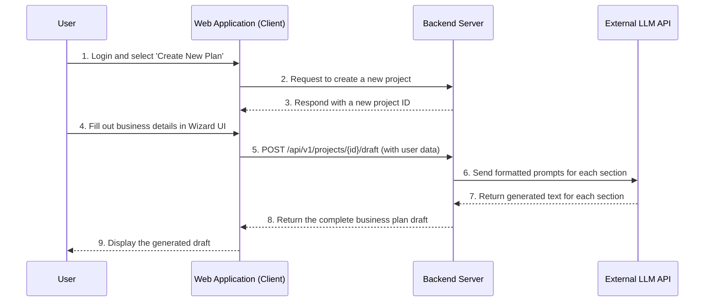
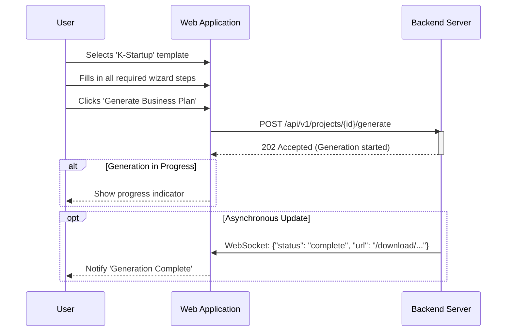
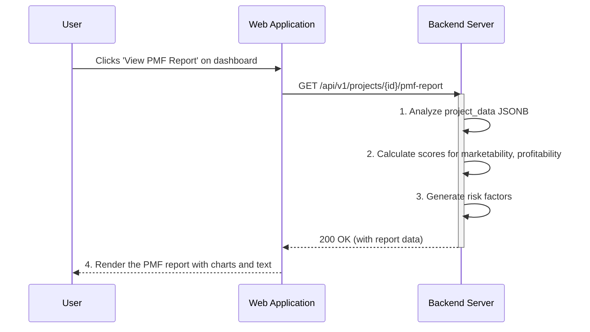

# Software Requirements Specification (SRS)

Document ID: SRS-001
Revision: 1.0
Date: 2025-11-15
Standard: ISO/IEC/IEEE 29148:2018

-------------------------------------------------

## 1. Introduction

### 1.1 Purpose

This document provides a detailed specification of the software requirements for the 'AI Co-pilot for Early-Stage Entrepreneurs'. The primary purpose of this system is to address the significant challenges faced by early-stage entrepreneurs in preparing business plans for government grants or loans. Specifically, it aims to reduce the complexity, time, and psychological burden associated with tasks like financial estimation, thereby lowering the high failure rate of startups caused by inadequate planning or premature scaling. This system will function as an intelligent partner, transforming the daunting business planning process into a data-driven, decision-making journey.

### 1.2 Scope

#### 1.2.1 In-Scope

The MVP of the system will include the following core functionalities as defined in the PRD (REF-03):
- **(F1) Template Provision:** Offers business plan templates compatible with major domestic government grants (e.g., K-Startup) and bank loan applications.
- **(F2) AI-Powered Draft Generation:** Automatically generates a narrative draft of a business plan using an LLM based on the user's core ideas.
- **(F3) Automated Financial Statements:** Creates 3-year estimated financial statements (Income Statement, Balance Sheet, Cash Flow Statement) from a few key user-input variables.
- **(F4) Wizard-style UI:** A step-by-step guided user interface to help non-experts complete their business plan.
- **(F5) PMF Diagnostic Report:** Provides a report that assesses marketability, profitability, and feasibility based on the user's input data.
- **(F6) On-Premise Option:** A Docker-based installable version for customers concerned about data security.

#### 1.2.2 Out-of-Scope

The following features are considered for future releases (Post-MVP) and are not part of this specification:
- **(F7) Dynamic Financial Dashboard:** A dashboard that shows real-time changes in financial projections as business hypotheses are modified.
- **(F8) Team Collaboration Features:** Real-time co-editing of business plans and integration with external tools like Jira or Notion.
- **Direct Submission:** Functionality to directly submit the completed business plan to government or bank websites.
- **Mobile Application:** A dedicated mobile application for the service.

### 1.3 Definitions, Acronyms, Abbreviations

| Term | Definition |
| :--- | :--- |
| **AC** | Acceptance Criteria: Conditions that a software product must meet to be accepted by a user. |
| **AI** | Artificial Intelligence |
| **API** | Application Programming Interface |
| **GWT** | Given-When-Then: A structured format for writing acceptance criteria. |
| **KPI** | Key Performance Indicator: A measurable value that demonstrates how effectively a company is achieving key business objectives. |
| **LLM** | Large Language Model: A type of AI model that can process and generate human-like text. |
| **MVP** | Minimum Viable Product: A version of a product with just enough features to be usable by early customers. |
| **PMF** | Product-Market Fit: The degree to which a product satisfies strong market demand. |
| **PRD** | Product Requirements Document: A document that outlines the product's purpose, features, functionalities, and behavior. |
| **SRS** | Software Requirements Specification: A detailed description of a software system to be developed. |
| **TAM/SAM/SOM** | Total Addressable Market / Serviceable Available Market / Serviceable Obtainable Market. |

### 1.4 References

| ID | Document Title | Location/Link |
| :--- | :--- | :--- |
| **REF-01** | Value Proposition Sheet | [2_핵심예제_분석자료/9-1_GPT-ValueProPositionSheetV2.md](</Users/kidsnote/Documents/workspace/BA-to-SW-Dev/2_핵심예제_분석자료/9-1_GPT-ValueProPositionSheetV2.md>) |
| **REF-02** | Market Analysis Data | [5_SaaS형_온라인_비즈니스_컨설팅_TAM-SAM-SOM_핵심_원인_Market_Segment_분석_보고서.md](</Users/kidsnote/Documents/workspace/BA-to-SW-Dev/2_핵심예제_분석자료/5_SaaS형_온라인_비즈니스_컨설팅_TAM-SAM-SOM_핵심_원인_Market_Segment_분석_보고서.md>) |
| **REF-03** | PRD: AI Co-pilot for Early-Stage Entrepreneurs | [3_Drafts-Model-Compare/Gemini-PRD/Gemini-PRD2.md](</Users/kidsnote/Documents/workspace/BA-to-SW-Dev/3_Drafts-Model-Compare/Gemini-PRD/Gemini-PRD2.md>) |

## 2. Stakeholders

| Role | Description | Responsibilities | Key Interests |
| :--- | :--- | :--- | :--- |
| **Kim Yebi (Prospective Entrepreneur)** | A user with a business idea but lacks experience in writing a formal business plan. | - Provide core business ideas and data. - Complete the business plan using the system. | - Quickly creating a compliant business plan for a government grant. - Avoiding disqualification due to incomplete or flawed documents. |
| **Choi Minhyuk (Re-entrepreneur)** | A user with past startup failure experience due to premature scaling. | - Provide detailed business assumptions. - Utilize the system for objective validation. | - Objectively validating market viability to avoid repeating past mistakes. - Making data-driven decisions to increase the probability of success. |
| **Han Seoyun (Growth-Stage Founder)** | A founder in need of structured data and a solid plan to attract VC investment. | - Input detailed company data and growth plans. | - Securing investment through a well-reasoned and data-backed business plan. |
| **Development Team** | The internal team responsible for designing, building, and maintaining the software. | - Implement all requirements specified in this SRS. - Ensure the system is robust, scalable, and secure. | - Clear, testable, and unambiguous requirements. - Stable architecture and manageable technical debt. |

## 3. System Context and Interfaces

### 3.1 External Systems
- **External LLM API (e.g., GPT-4, Gemini):** Used for generating the narrative content of the business plan. The system will send structured prompts and receive text in return.
- **Payment Gateway (e.g., Stripe):** Used for processing payments for subscription plans.
- **Analytics & Monitoring Tools (Datadog, Amplitude, Metabase, etc.):** Used to track system performance, user behavior, and business KPIs.

### 3.2 Client Applications
- **Web Application:** The primary interface for users. It will be a browser-based application accessible from modern desktop web browsers.

### 3.3 API Overview
The system architecture is based on a client-server model. The client (Web Application) communicates with the backend server via a RESTful API. The backend server, in turn, interacts with external systems like the LLM API and payment gateway. All user data is stored and managed on the server-side.

### 3.4 Interaction Sequences (Core Flow)

This diagram illustrates the core user flow of generating a business plan draft.

## 4. Specific Requirements

### 4.1 Functional Requirements

| ID | Requirement Description | Source | Acceptance Criteria (GWT) | Priority |
| :--- | :--- | :--- | :--- | :--- |
| **REQ-FUNC-001** | The system shall provide a list of business plan templates for selection. | F1 | **Given** a user has logged in, **When** they navigate to the 'Create New Plan' page, **Then** a list of available templates (e.g., 'K-Startup Grant', 'Bank Loan Application') must be displayed. | Must |
| **REQ-FUNC-002** | The system shall allow the user to download the final business plan in `.hwp`, `.docx`, and `.pdf` formats. | F1 | **Given** a business plan has been generated, **When** the user clicks the 'Download' button, **Then** they must be presented with options to download in `.hwp`, `.docx`, or `.pdf` format. | Must |
| **REQ-FUNC-003** | The system shall present a wizard-style UI to guide the user through the business plan creation process. | F2, F4 | **Given** a user has selected a template, **When** they start the project, **Then** the system must display a step-by-step interface, showing progress and clear instructions for each section. | Must |
| **REQ-FUNC-004** | The system shall collect user inputs for core business ideas, market analysis, and team information via the wizard UI. | F2 | **Given** the user is in the wizard UI, **When** they fill in a form field (e.g., 'Business Item'), **Then** the input must be saved and associated with their project. | Must |
| **REQ-FUNC-005** | The system shall automatically generate a narrative draft of the business plan by calling an external LLM API. | F2 | **Given** the user has completed all mandatory input sections in the wizard, **When** they click 'Generate Draft', **Then** the system must generate a full draft document based on their inputs. | Must |
| **REQ-FUNC-006** | The system must prevent draft generation if mandatory fields are missing. | Story 1 (Kim Yebi) | **Given** the user has skipped a mandatory section (e.g., 'Financial Estimation'), **When** they click 'Generate Draft', **Then** the system must display an error message specifying which section needs to be completed. | Must |
| **REQ-FUNC-007** | The system shall allow users to input 5 key financial variables (e.g., expected customers, monthly fee). | F3 | **Given** the user is in the 'Financial Estimation' step of the wizard, **When** the form is displayed, **Then** input fields for the 5 key financial variables must be present. | Must |
| **REQ-FUNC-008** | The system shall automatically generate a 3-year projected Income Statement based on the key financial variables. | F3 | **Given** the user has entered valid financial variables, **When** they submit the form, **Then** a 3-year projected Income Statement must be generated and displayed. | Must |
| **REQ-FUNC-009** | The system shall automatically generate a 3-year projected Balance Sheet based on the key financial variables. | F3 | **Given** the user has entered valid financial variables, **When** they submit the form, **Then** a 3-year projected Balance Sheet must be generated and displayed. | Must |
| **REQ-FUNC-010** | The system shall automatically generate a 3-year projected Cash Flow Statement based on the key financial variables. | F3 | **Given** the user has entered valid financial variables, **When** they submit the form, **Then** a 3-year projected Cash Flow Statement must be generated and displayed. | Must |
| **REQ-FUNC-011** | The system shall generate a PMF diagnostic report based on the completed business plan data. | F5, Story 2 (Choi Minhyuk) | **Given** a user has a completed business plan draft, **When** they click 'View PMF Report' from their dashboard, **Then** a report containing market analysis, competitor analysis, and key risks must be displayed. | Must |
| **REQ-FUNC-012** | The system shall provide a Docker-based installation package for on-premise deployment. | F6 | **Given** a customer has purchased an on-premise license, **When** they access their download page, **Then** a `docker-compose.yml` file and associated Docker images must be available for download. | Should |
| **REQ-FUNC-013** | The system must provide a comprehensive installation manual for the on-premise version. | F6 | **Given** a customer is setting up the on-premise version, **When** they consult the documentation, **Then** it must provide clear, step-by-step instructions for a successful installation. | Should |

### 4.2 Non-Functional Requirements

| ID | Category | Requirement | Threshold / Standard | Monitoring Method |
| :--- | :--- | :--- | :--- | :--- |
| **REQ-NF-001** | Performance | AI Business Plan Draft Generation Time | <= 60 seconds (p95) | Datadog APM |
| **REQ-NF-002** | Performance | Real-time Financial Statement Calculation | <= 2 seconds (p95) after variable input | Datadog APM |
| **REQ-NF-003** | Performance | Web Page Load Speed (LCP) | <= 3 seconds | Google Lighthouse |
| **REQ-NF-004** | Security | Data Encryption at Rest | All user data must be encrypted using AES-256. | AWS KMS Audits |
| **REQ-NF-005** | Security | Data Encryption in Transit | All network traffic must use TLS 1.3+. | Security Hub |
| **REQ-NF-006** | Usability | On-Premise Installation Time | <= 30 minutes for a user with basic Docker knowledge. | User Feedback, Installation Script Logs |
| **REQ-NF-007** | Availability | Cloud Service Uptime | >= 99.5% | AWS CloudWatch |
| **REQ-NF-008** | Localization | Language Support | The initial release will only support Korean. | - |
| **REQ-NF-009** | Dependency | AI Model | The system will rely on external LLM APIs (e.g., GPT-4, Gemini). | - |
| **REQ-NF-010** | Scalability | Concurrent Users | The system must support 1,000 concurrent users with performance metrics met. | Load Testing (k6, JMeter) |
| **REQ-NF-011** | Maintainability | Code Coverage | Unit and integration tests must achieve >80% code coverage. | SonarQube |
| **REQ-NF-012** | Business | Customer Funding Success Rate | Increase customer funding success rate by 30% over baseline. | User Surveys |
| **REQ-NF-013** | Business | User Satisfaction (CSAT) | Achieve a CSAT score of >= 4.5/5.0 for the AI financial estimation feature. | In-app Surveys |

## 5. Traceability Matrix

| User Story / Source Feature | Requirement ID(s) | Test Case ID(s) |
| :--- | :--- | :--- |
| Story 1: Kim Yebi (Get grant funding) | REQ-FUNC-001, REQ-FUNC-003, REQ-FUNC-005, REQ-FUNC-006 | TC-FUNC-001, TC-FUNC-003, TC-FUNC-005, TC-FUNC-006 |
| Story 2: Choi Minhyuk (Validate idea) | REQ-FUNC-011 | TC-FUNC-011 |
| F1: Templates | REQ-FUNC-001, REQ-FUNC-002 | TC-FUNC-001, TC-FUNC-002 |
| F2: AI Draft Generation | REQ-FUNC-003, REQ-FUNC-004, REQ-FUNC-005 | TC-FUNC-003, TC-FUNC-004, TC-FUNC-005 |
| F3: Financial Automation | REQ-FUNC-007, REQ-FUNC-008, REQ-FUNC-009, REQ-FUNC-010 | TC-FUNC-007, TC-FUNC-008, TC-FUNC-009, TC-FUNC-010 |
| F4: Wizard UI | REQ-FUNC-003 | TC-FUNC-003 |
| F5: PMF Report | REQ-FUNC-011 | TC-FUNC-011 |
| F6: On-Premise Option | REQ-FUNC-012, REQ-FUNC-013 | TC-FUNC-012, TC-FUNC-013 |
| PRD Section 5: NFRs | REQ-NF-001 to REQ-NF-009 | TC-NF-001 to TC-NF-009 |

## 6. Appendix

### 6.1 API Endpoint List

| Method | Endpoint | Description |
| :--- | :--- | :--- |
| `POST` | `/api/v1/auth/register` | User registration. |
| `POST` | `/api/v1/auth/login` | User login. |
| `GET` | `/api/v1/projects` | Get a list of the user's projects. |
| `POST` | `/api/v1/projects` | Create a new business plan project. |
| `GET` | `/api/v1/projects/{projectId}` | Get details of a specific project. |
| `PUT` | `/api/v1/projects/{projectId}` | Update project data (e.g., user inputs). |
| `POST` | `/api/v1/projects/{projectId}/generate` | Trigger the AI draft generation process. |
| `GET` | `/api/v1/projects/{projectId}/download` | Download the generated document. |
| `GET` | `/api/v1/projects/{projectId}/pmf-report` | Get the PMF diagnostic report. |
| `GET` | `/api/v1/templates` | Get a list of available business plan templates. |

### 6.2 Entity & Data Model

#### Users
| Column | Type | Constraints | Description |
| :--- | :--- | :--- | :--- |
| `user_id` | UUID | Primary Key | Unique identifier for the user. |
| `email` | VARCHAR(255) | Not Null, Unique | User's email address. |
| `password_hash` | VARCHAR(255) | Not Null | Hashed password. |
| `created_at` | TIMESTAMPZ | Not Null | Timestamp of user creation. |

#### Projects
| Column | Type | Constraints | Description |
| :--- | :--- | :--- | :--- |
| `project_id` | UUID | Primary Key | Unique identifier for the project. |
| `user_id` | UUID | Foreign Key (Users) | The user who owns the project. |
| `template_id` | UUID | Foreign Key (Templates) | The template used for the project. |
| `project_name` | VARCHAR(255) | Not Null | Name of the business plan project. |
| `project_data` | JSONB | - | Stores all user inputs from the wizard. |
| `generated_doc` | TEXT | - | The full generated business plan text. |
| `created_at` | TIMESTAMPZ | Not Null | Timestamp of project creation. |
| `updated_at` | TIMESTAMPZ | Not Null | Timestamp of last update. |

### 6.3 Detailed Interaction Models

#### AC 1.1: Successful Business Plan Generation

#### AC 2.1: Viewing the PMF Report

