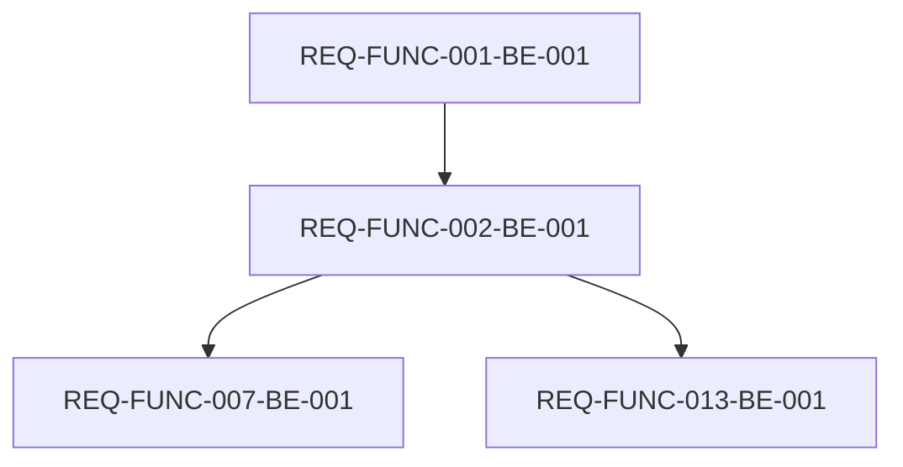
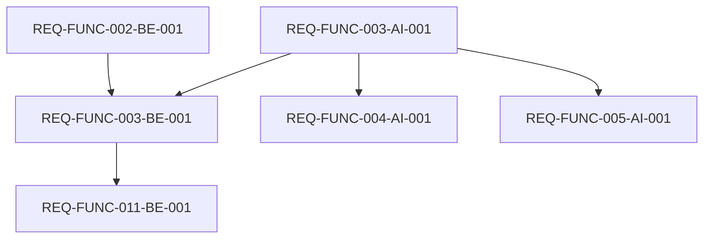
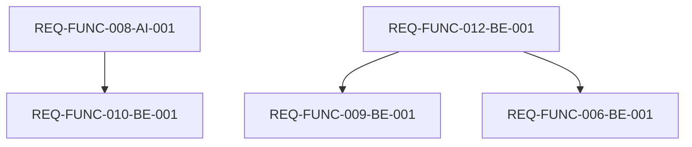
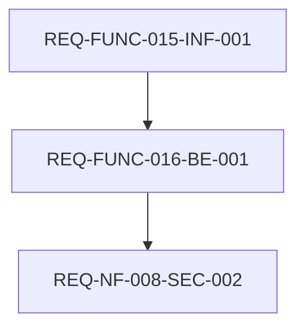
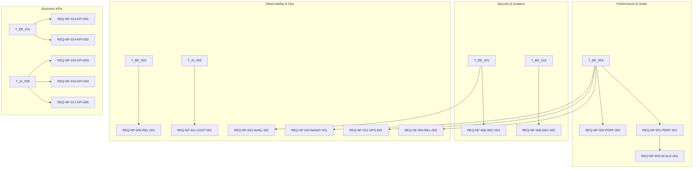

# Integrated Task Tree (WBS) & Dependency Graph (DAG) – GPT-5.1 Edition

## 1. Work Breakdown Structure (WBS)

### 1.1 EPIC 0: Frontend PoC Prototype (MVP UI/UX)

- **Feature: Project & Wizard UI**
  - `EPIC0-FE-001`: 프로젝트 생성 및 Wizard 기본 레이아웃 PoC
  - `EPIC0-FE-002`: Wizard 입력 폼 및 자동저장 UI PoC
- **Feature: Document Generation & View**
  - `EPIC0-FE-003`: 사업계획서 초안 생성 및 뷰어 UI PoC
- **Feature: Financial & PMF UI**
  - `EPIC0-FE-004`: 재무 입력 및 유닛 이코노믹스 시각화 UI PoC
  - `EPIC0-FE-005`: PMF 진단 설문 및 리포트 UI PoC

### 1.2 EPIC 1: 과제 통과 Job (To pass the test)

- **Feature: Core API & Data**
  - `REQ-FUNC-001-BE-001`: 프로젝트 생성 및 템플릿 목록 API
  - `REQ-FUNC-002-BE-001`: Wizard 단계별 답변 저장/조회 API
  - `REQ-FUNC-007-BE-001`: 필수 입력 검증 및 에러 응답 처리
  - `REQ-FUNC-013-BE-001`: 자동저장(Auto-save) 처리 및 타임스탬프 로깅
- **Feature: Document Generation Pipeline**
  - `REQ-FUNC-003-AI-001`: 사업계획서 생성 LLM 엔진 (FastAPI)
  - `REQ-FUNC-003-BE-001`: 사업계획서 생성 오케스트레이션 API (Spring Boot)
  - `REQ-FUNC-004-AI-001`: 섹션별 AI 작성/보완 엔드포인트
  - `REQ-FUNC-005-AI-001`: 제출 가능성 체크리스트 및 보완 가이드 엔진
- **Feature: Export**
  - `REQ-FUNC-011-BE-001`: HWP/PDF 내보내기 기능

### 1.3 EPIC 2: 실패 회피 Job (To avoid failure)

- **Feature: PMF Diagnosis**
  - `REQ-FUNC-008-AI-001`: PMF 진단 및 리포트 생성 LLM 엔진
  - `REQ-FUNC-010-BE-001`: PMF 데이터 부족 검증 및 에러 처리 로직
- **Feature: Financial Engine**
  - `REQ-FUNC-012-BE-001`: 재무 추정 및 유닛 이코노믹스 계산 엔진
  - `REQ-FUNC-009-BE-001`: 유닛 이코노믹스 계산 결과 조회 API
  - `REQ-FUNC-006-BE-001`: 재무-서술 논리 정합성 검증 엔진/API

### 1.4 EPIC 3: On-premise & Workspace Isolation (Design-first, Post-MVP)

- **Feature: On-prem Package**
  - `REQ-FUNC-015-INF-001`: On-premise/Private Cloud 배포 패키지 설계
- **Feature: Workspace Security & Isolation**
  - `REQ-FUNC-016-BE-001`: 워크스페이스별 데이터 격리 설정 API 설계

### 1.5 EPIC 4: Non-Functional & Operations

- **Feature: Security & Data Protection**
  - `REQ-NF-006-SEC-001`: 데이터 저장/전송 암호화 및 보안 구성
  - `REQ-NF-008-SEC-002`: 워크스페이스/배포옵션별 데이터 격리 검증
- **Feature: QA & Performance**
  - `REQ-NF-001-PERF-001`: 주요 API 성능 테스트(k6) 환경 구축
  - `REQ-NF-002-PERF-002`: 문서/PMF 생성 성능 검증 및 튜닝
  - `REQ-NF-005-REL-001`: 자동저장 주기/신뢰성 검증
  - `REQ-NF-009-SCALE-001`: 동시 1,000 세션 부하 테스트/스케일링 전략
- **Feature: Observability & Operations**
  - `REQ-NF-012-OPS-001`: 구조화된 로깅 및 Prometheus/Grafana 모니터링 구축
  - `REQ-NF-003-AVAIL-001`: Health Check, SLA 모니터링, 롤링 배포 전략
  - `REQ-NF-004-REL-002`: 주요 기능 오류율 모니터링 및 재시도/회로차단기 설계
  - `REQ-NF-010-MAINT-001`: 템플릿/Validator 구성 기반 업데이트 플로우
  - `REQ-NF-011-COST-001`: LLM 토큰 사용량 제한 및 비용 모니터링 대시보드
  - `REQ-NF-018-RESIL-001`: 백업/복구(Backup & DR) 설정 및 리허설
- **Feature: Business KPI Tracking**
  - `REQ-NF-013-KPI-001`: TTV(Time-to-Value) 이벤트 설계 및 분석
  - `REQ-NF-014-KPI-002`: Activation Rate 측정용 이벤트/퍼널 설계
  - `REQ-NF-015-KPI-003`: 과제 통과율 집계 로직 및 설문 플로우
  - `REQ-NF-016-KPI-004`: NPS 수집/분석 플로우
  - `REQ-NF-017-KPI-005`: Cross-sell Rate(학습/검증 기능 사용률) 추적

---

## 2. Dependency Graph (DAG)

### 2.1 Flow 1: Basic Setup & UI PoC

```mermaid
graph TD
    Setup[Project Setup (FE/BE 기본 골격)] --> EPIC0-FE-001
    EPIC0-FE-001 --> EPIC0-FE-002
    EPIC0-FE-002 --> EPIC0-FE-003
    EPIC0-FE-001 --> EPIC0-FE-004
    EPIC0-FE-001 --> EPIC0-FE-005
```

### 2.2 Flow 2: Core Backend & Wizard



### 2.3 Flow 3: Document Generation Pipeline



### 2.4 Flow 4: PMF & Financial Engine



### 2.5 Flow 5: On-prem & Isolation (Post-MVP)



### 2.6 Flow 6: NFR Support



---

## 3. Execution Strategy (Phase-based)

1. **Phase 1 – UI/UX PoC (Epic 0)**  
   - `EPIC0-FE-001` ~ `EPIC0-FE-005`를 중심으로 화면/플로우 전반을 넓게 커버.  
   - API/엔진은 Mock/Stub으로 대체하고, 정보 구조와 UX를 검증.

2. **Phase 2 – Core API & Data (Epic 1 일부)**  
   - `REQ-FUNC-001-BE-001`, `REQ-FUNC-002-BE-001`, `REQ-FUNC-007-BE-001`, `REQ-FUNC-013-BE-001`.  
   - Project/답변 저장 구조 확정 → 이후 모든 기능의 데이터 기반.

3. **Phase 3 – Document Generation & Export**  
   - `REQ-FUNC-003-AI-001`, `REQ-FUNC-003-BE-001`, `REQ-FUNC-004-AI-001`, `REQ-FUNC-005-AI-001`, `REQ-FUNC-011-BE-001`.  
   - 사업계획서 생성/체크리스트/Export까지 end-to-end 플로우 완성.

4. **Phase 4 – PMF & Financial Engine**  
   - `REQ-FUNC-008-AI-001`, `REQ-FUNC-010-BE-001`, `REQ-FUNC-012-BE-001`, `REQ-FUNC-009-BE-001`, `REQ-FUNC-006-BE-001`.  
   - 실패 회피 Job과 재무 자동화 기능 구현.

5. **Phase 5 – NFR & Operations**  
   - 성능/보안/운영/관측성/비즈니스 KPI Task(`REQ-NF-XXX-*`) 병렬 실행.  
   - 실서비스 관점에서 SLA, 비용, 안정성을 보완.

6. **Phase 6 – On-prem & Workspace Isolation (Post-MVP)**  
   - `REQ-FUNC-015-INF-001`, `REQ-FUNC-016-BE-001` 및 연관 REQ-NF(특히 `REQ-NF-008`)를  
     설계/PoC 수준으로 구현한 뒤, Phase 2 제품에 반영.

이 문서는 `11-1` 문서의 단계 6, 7 및 `11-2` 문서의 단계 6 내용을  
**실제 Task ID와 의존관계를 가진 형태로 구체화한 통합 WBS/DAG 산출물**입니다.


